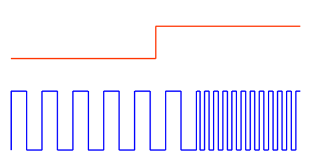
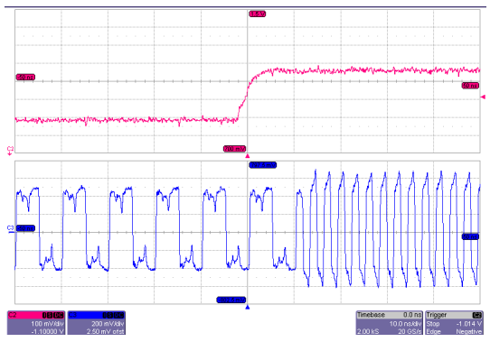
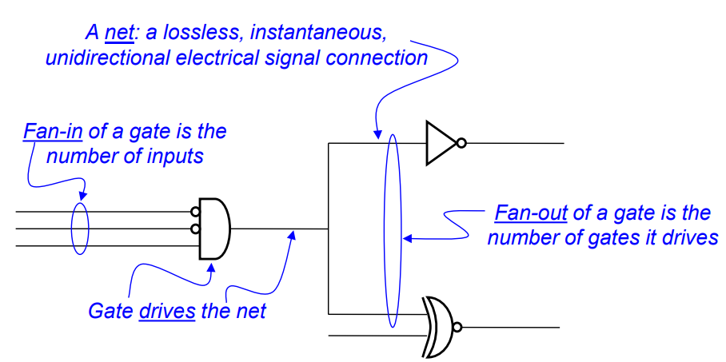
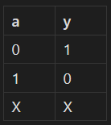
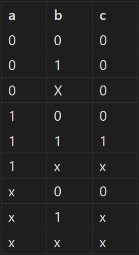
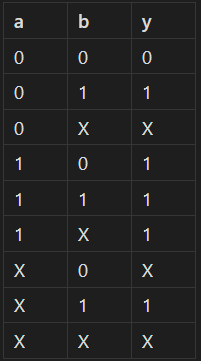
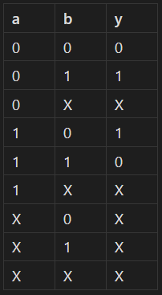
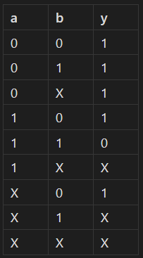
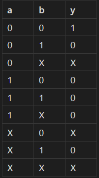

## Lecture 1 - Introduction
### Some books
The Design of Digital Systems
J.B. Peatman ISBN: 9780070859579

## Lecture 2 - Combinatorial Logic
### Real-World Logic
- In theory, there are two states: $1$ and $0$. However, in practice, things are never that neat. In the real world, voltages are often noisy, slow to adapt and about as *analogue* as they come.

| In Theory                                  | In Practice                              |     |
| ------------------------------------------ | ---------------------------------------- | --- |
|  |  |     |
- In the real world, to get around some of these problems, the voltage is split up to three regions: 
	- Logic High ($1$)
	- *The Forbidden Zone*
	- Logic Low ($0$)
	When the voltage is between the supply ($V_{cc}$) and some high threshold ($V_{th}$), then we read a logic high. On the other hand if the voltage is between 0 and some low threshold ($V_{tl}$), we read a logic low. The area between the high and low thresholds is *the forbidden zone*.
	*The forbidden zone* is a bit of misnomer, there is nothing about it that is *actually* forbidden, you totally can and will get voltages in this zone, especially during the transition between states. However, when in this zone, results will often be actually, genuinely random and otherwise completely useless.
## Boolean Algebra
Boolean algebra, like other algebras, consists of a set of operators and values. These are $\{ \text{AND}, \text{OR},, \text{NOT} 0, 1 \}$.

> [!note] Alternate Naming Conventions
> $\text{AND}$ may also be notated as '$\wedge$', '\*', '$\cdot$' or be notated with no symbol at all (like with multiplication)
> $\text{OR}$  may also be notated as '$\vee$' or '+'
> $\text{NOT}$ may also be notated as '$x'$', '~$x$' or '$\overline{x}$'

There are a few axioms for use in Boolean algebra:
- Closure - if $x, y \in \mathbb{B}$, then $x + y \in \mathbb{B}$ and $x * y \in \mathbb{B}$
- Identities - $x + 0 = x$ and $x * 1 = x$
- Commutativity - $x + y = y + x$, $x * y = y*x$
- Distributivity - $x * (y + z) = (x * y) + (x * z)$ and $x + (y * z) = (x + y) * (x + z)$
- Complementation - $x + x' = 1$, $x * x' = 0$

One neat fact is that, technically, it is possible to make $\text{OR}$ by using only $\text{AND}$ and $\text{NOT}$, and similarly, $\text{AND}$ by using only $\text{OR}$ and $\text{NOT}$. For example: $(A' * B')' = A + B$. It is for this reason, that most common logic gates nowadays are made entirely using NAND gates, as these are the cheapest to manufacture.
##### Common Terminology

> [!info]- In Reality...
> - Nets are not instantaneous or unidirectional
> - Fan-out may also affect the electrical properties of the gate driving it
### Caveats
*In theory* (there's that term again), all the above is true, but in reality there are a few caveats here which can, and sometimes do matter:
1. **Transport / Gate delay** - It takes some time for a gate to respond after an input has changed
> 	Note that this is mostly irrelevant today.
2. **Interconnect delay** - It takes some time for signals to cross a wire
### Latches
A latch is a circuit that can store a bit of data indefinitely (at least in theory, in practice, there still needs to be some source of power, but in terms of just the logic, indefinitely)
Consider this simple latch made using a NAND gate:
![[01-10-2024-img4.png]]
If A is 1, and B is 0, then Y  will be 1, thus sustaining B at zero. Even if A then becomes 0, due to the loopback, B will remain at zero and Y at 1.  Conversely, if A is 0, and B is 1, then y will be 1, making B 0. This too is a consistent state.

Given this design for two interconnected latches
![[01-10-2024-img5.png]]
If we set A to 1 (from 0), then both $g_1$ and $g_2$ are triggered. If $g_1$ reacted first, then $Q_1$ would become 1, and then following that when $g_2$ triggers, $Q_2$ would be 0. We can clearly see that should $g_1$ react second, and $g_2$ first, then the opposite would occur.  
In the real world, though we will get a consistent result, with $Q_1$ and $Q_2$ finding consistent states, exactly what those states *are* cannot be predicted. This is due to manufacturing tolerances for each of the gates and wiring lengths and so on. Ultimately, we *want to know* that there is uncertainty here while we are designing the circuit.
### 3 State Boolean Logic
To fix the issue outlined above, we add a third state, $X$, which means 'we don't know'. Though this might seem wrong for Boolean logic, adding another state, we are not *really* doing that. All this says that the value is 1 or 0, but we just don't know which one it will be. Because of this, we call $X$ a *metavalue*; this means that though we can write it in designs and simulations, it can never be measured in the real world.
Following are how all gates react to the $X$ state:

| $\text{NOT}$                 | $\text{AND}$                   | $\text{OR}$                   | $\text{XOR}$                  | $\text{NAND}$                  | $\text{NOR}$                   |
| ---------------------------- | ------------------------------ | ----------------------------- | ----------------------------- | ------------------------------ | ------------------------------ |
|  |  |  |  |  |  |
There is one final condition we add. It is now impossible for a state transition of 0 $\rightarrow$ 1 to occur. All transitions must first go through X.