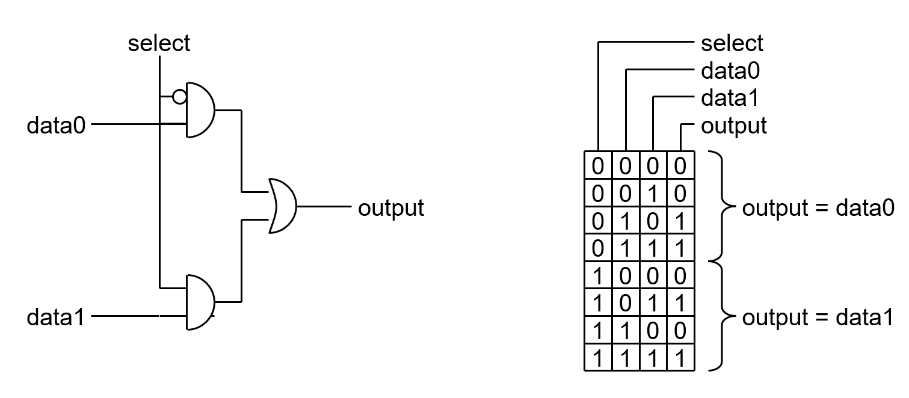

### Real-World Logic
- In theory, there are two states: $1$ and $0$. However, in practice, things are never that neat. In the real world, voltages are often noisy, slow to adapt and about as *analogue* as they come.

| In Theory                                  | In Practice                              |
| ------------------------------------------ | ---------------------------------------- |
|  |  |
- In the real world, to get around some of these problems, the voltage is split up to three regions: 
	- Logic High ($1$)
	- *The Forbidden Zone*
	- Logic Low ($0$)
	When the voltage is between the supply ($V_{cc}$) and some high threshold ($V_{th}$), then we read a logic high. On the other hand if the voltage is between 0 and some low threshold ($V_{tl}$), we read a logic low. The area between the high and low thresholds is *the forbidden zone*.
	*The forbidden zone* is a bit of misnomer, there is nothing about it that is *actually* forbidden, you totally can and will get voltages in this zone, especially during the transition between states. However, when in this zone, results will often be actually, genuinely random and otherwise completely useless.
## Boolean Algebra
Boolean algebra, like other algebras, consists of a set of operators and values. These are $\{ \text{AND}, \text{OR},, \text{NOT} 0, 1 \}$.

> [!note] Alternate Naming Conventions
> $\text{AND}$ may also be notated as '$\wedge$', '\*', '$\cdot$' or be notated with no symbol at all (like with multiplication)
> $\text{OR}$  may also be notated as '$\vee$' or '+'
> $\text{NOT}$ may also be notated as '$x'$', '~$x$' or '$\overline{x}$'

There are a few axioms for use in Boolean algebra:
- Closure - if $x, y \in \mathbb{B}$, then $x + y \in \mathbb{B}$ and $x * y \in \mathbb{B}$
- Identities - $x + 0 = x$ and $x * 1 = x$
- Commutativity - $x + y = y + x$, $x * y = y*x$
- Distributivity - $x * (y + z) = (x * y) + (x * z)$ and $x + (y * z) = (x + y) * (x + z)$
- Complementation - $x + x' = 1$, $x * x' = 0$

One neat fact is that, technically, it is possible to make $\text{OR}$ by using only $\text{AND}$ and $\text{NOT}$, and similarly, $\text{AND}$ by using only $\text{OR}$ and $\text{NOT}$. For example: $(A' * B')' = A + B$. It is for this reason, that most common logic gates nowadays are made entirely using NAND gates, as these are the cheapest to manufacture.
##### Common Terminology

> [!info]- In Reality...
> - Nets are not instantaneous or unidirectional
> - Fan-out may also affect the electrical properties of the gate driving it
### Caveats
*In theory* (there's that term again), all the above is true, but in reality there are a few caveats here which can, and sometimes do matter:
1. **Transport / Gate delay** - It takes some time for a gate to respond after an input has changed
> 	Note that this is mostly irrelevant today.
2. **Interconnect delay** - It takes some time for signals to cross a wire
### Latches
A latch is a circuit that can store a bit of data indefinitely (at least in theory, in practice, there still needs to be some source of power, but in terms of just the logic, indefinitely)
Consider this simple latch made using a NAND gate:
![[images/Combinatorial_Logic-Simple_Latch.png]]
If A is 1, and B is 0, then Y  will be 1, thus sustaining B at zero. Even if A then becomes 0, due to the loopback, B will remain at zero and Y at 1.  Conversely, if A is 0, and B is 1, then y will be 1, making B 0. This too is a consistent state.
##### Race Conditions
Given this design for two interconnected latches
![[images/Combinatorial_Logic-Uncertain_Latch.png]]
If we set A to 1 (from 0), then both $g_1$ and $g_2$ are triggered. If $g_1$ reacted first, then $Q_1$ would become 1, and then following that when $g_2$ triggers, $Q_2$ would be 0. We can clearly see that should $g_1$ react second, and $g_2$ first, then the opposite would occur.  
In the real world, though we will get a consistent result, with $Q_1$ and $Q_2$ finding consistent states, exactly what those states *are* cannot be predicted. This is due to manufacturing tolerances for each of the gates and wiring lengths and so on. Ultimately, we *want to know* that there is uncertainty here while we are designing the circuit.
### 3 State Boolean Logic
To fix the issue outlined above, we add a third state, $X$, which means 'we don't know'. Though this might seem wrong for Boolean logic, adding another state, we are not *really* doing that. All this says that the value is 1 or 0, but we just don't know which one it will be. Because of this, we call $X$ a *metavalue*; this means that though we can write it in designs and simulations, it can never be measured in the real world.
Following are how all gates react to the $X$ state:

| $\text{NOT}$                                       | $\text{AND}$                                         | $\text{OR}$                                        | $\text{XOR}$                                        | $\text{NAND}$                                        | $\text{NOR}$                          |
| -------------------------------------------------- | ---------------------------------------------------- | -------------------------------------------------- | --------------------------------------------------- | ---------------------------------------------------- | ------------------------------------- |
|  |  |  |  |  |  |
There is one final condition we add. It is now impossible for a state transition of 0 $\rightarrow$ 1 to occur. All transitions must first go through $X$.
By adding the new $X$ state, the latch shown above now becomes algebraically predictable.
> *A* transitions from $0$ to $1$, going through $X$. As $Q_1$ and $Q_2$ are both unknown, these start as $X$. Thus, both gates have an input of $1$ and $X$. Thus, they both lapse into the $X$ state as an output. This is consistent, if not a particularly useful answer in the real world.
##### MUXes
*MUXes*, also known as multiplexers, are circuits that switch which input value is forwarded to the output, based on some control signal. The main type to know about is the 1-bit *MUX*. This drives a load based on two inputs, and uses one signal as a control.

By stringing together multiple 1-bit *MUXes*, with a decoder, it is possible to add more inputs, assuming that only one output is desired.
### 4 State Boolean Logic
For any given register in a CPU, it will be connected to many different sources, and will need many MUXes to attend to it. Further, digital systems will also use many registers. Thus, we will create a highly complex net, which may lead to issues in timing, resistance, interference or most importantly, cost of manufacture.
Thus, we have a solution: the *Bus*. At any one point in time, only one input is allowed to drive the bus and any number of outputs, though usually one, reads from the wire (a bus is just a wire connected to many inputs). However, to make this work, we need to be able to electrically disconnect two parts of the circuit. Algebraically, this is done by introducing a new state $Z$. A circuit may *assert* a $Z$ state, just as it may assert any other. The $Z$ state asserted is a logic value, unlike the $X$ state, and represents a disconnection from the bus: if a $Z$ state is asserted, the value of the bus will not be changed by this, and may continue to change due to outside interference.

To allow for the assertion of a $Z$ state, we introduce a new type of gate, the *tri-state buffer*. 
This is a gate that passes through the input value to the output, except for when the control line is pulled high, when the output moves to the $Z$ state. In the event the control line is $X$, the output is also $X$.
### 5 State Boolean Logic
When dealing with busses, it is possible for two lines to assert a value on the bus at the same time. This is not desirable, and is considered extremely bad practice. When this happens and the two values being asserted are different (ie. 1 and 0), we enter a conflict state ($C$). Though the results of such a state are well defined in algebra, they are of little consequence in real life, as a conflict state often results in the destruction of components and the melting of wires, usually via short-circuit.
### 8 State Boolean Logic
The first five states discussed above are the most important, but there are also three more states.
- $H$ - High Impedance 1
- $L$ - Low Impedance 0 
- $U$ - Uninitialised
The $H$ and $L$ states equate to a line that is being driven by a $Z$ state, however it has a pull-up or pull-down resistor attached to it . Thus, the line will tend towards a logic state (1 or  0), when not actively being driven otherwise.
The $U$ state is what all lines are set to at the beginning of computation, before the circuit is even powered on. This value is overwritten by any other value. Generally, the purpose of this state is to allow for identification of parts of the circuit that are never touched, and should likely be removed.
### De Morgan's Theorem
Strictly, we don't actually need both $\text{AND}$ and $\text{OR}$. By De Morgan's theorem:
$A + B = (A' \cdot B')'$ and $A \cdot B = (A' + B')'$
### One More Operator
$\text{XOR}$ is not strictly a primitive operator, but it is used so often, that it is often treated as one. The symbol used for $\text{XOR}$ is either $\bigoplus$ or $\bigotimes$.
### Karnaugh Maps
A Karnaugh (sometimes called a K Map) map is another way of graphically representing logic circuits, aside from truth tables. By moving into the second dimension, the ability to simplify the circuits graphically is unlocked. If we extend all Karnaugh maps such that they tile in each dimension, then further simplification is doable. 
![[images/Combinatorial_Logic-Karnaugh_Maps.png]]
> [!info] Dimensions beyond your comprehension
> Most people would stop at 6-dimensional Karnaugh maps, as that becomes almost impossible to reason about.
##### Gray Codes
A Gray code is a sequence of binary numbers where each one differs only by one bit. It is important to note that they are used to label the axis on a Karnaugh map.
There is one Gray code for $n=2$ : $\{00, 01, 11, 10\}$. There is also one code for $n = 3$ : $\{000,001,011,010,110,111,101,100\}$. For $n \ge 4$, there are multiple valid codes.
##### Simplifying with Karnaugh Maps
To simplify with Karnaugh maps, group the cells in the map into (possibly overlapping) rectangles with side lengths that are powers of 2 (ie. 1, 2, 4 generally). Each of these groups can then be reduced to the minimal logic expression that results in those values. Finally, these expressions can be $\text{OR}$'ed together, and this might then be simplified manually, though this is harder to do (but still doable by hand).
##### X
When given a function that is defined as having an output of $\text{X}$, we can also include this in a Karnaugh map.
![[images/Combinatorial_Logic-Karnaugh_Map_with_x.png]]
This allows for easier optimisation of the circuit, as any $\text{X}$ can be included in any groupings. So for the example above, a 2x2 square grouping can be made in the middle, and that is valid, as we don't care what that value is: if it's 1, then that's fine.
##### Sum of Products Form
Consider the function $Y = AB + BC$. We can use a Karnaugh map to simplify this down trivially to $Y = A'BC + ABC' + ABC$. Though this can be simplified into $Y = B(A + C)$, if we don't and just leave it as is, it will be in sum of products form. This may be desirable for one main reason when designing logic circuits in the real world: *gate delay*. That is, due to the fact that no matter what path the signals take, they will always go through the same number of gates. This means that, if the following circuits rely on timing, the time for this circuit can be ensured to be constant (assuming each gate in a layer has the same delay)
##### Product of Sums Form
By using the duality of $\text{AND}$ and $\text{OR}$, we can take any arbitrary statement in SOP form, and convert it to product of sums form.