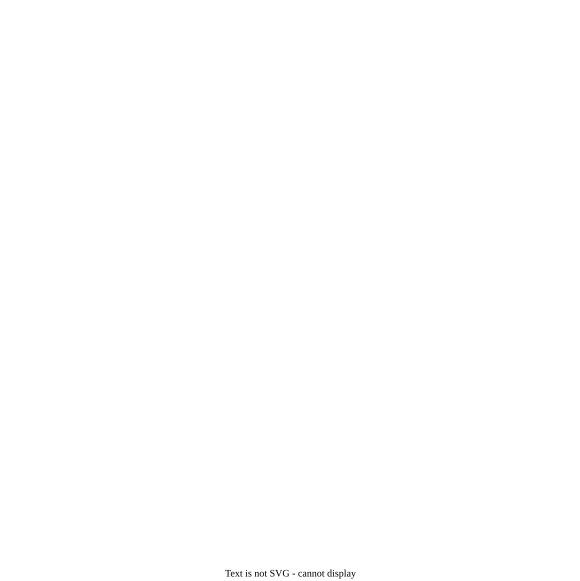

#maths/applied-maths #maths/pure-maths/calculus/differential-equations 
Imagine a container (pictured below), with some amount of liquid flowing in at a given rate ($R_{in}$), and flowing out at a given rate ($R_{out}$). The amount of the input fluid in the container is $x$. Using only this information, we can get a single first order differential equation.

There are four steps to calculate for this kind of question.
1. Find the volume of fluid after $T$ days.
2. Find the concentration of input fluid after $T$ days
3. Find the rate of input fluid entering the container
4. Find the rate of the input fluid leaving the container
5. Make the differential equation.
### An Example
A pond leaks at a rate of 20 Litres / day of pond water. To fix this, water is added at a rate of 25 Litres / day. This water is contaminated, with 2 grams per litre of contaminant. At $T = 0$, there is 1000 Litres of uncontaminated water in the pond. $x$ is the number of grams of pollutant in the pond at time $T$.
1. Volume in pond after $T$ days
	$1000 + 25T - 20T$
	$1000 + 5T$ Litres
2. Concentration of pollutant in pond after $T$ days
	$\frac{x}{1000 + 5T}$ grams / Litre
3. Rate of pollutant entering the pond
	$\frac{\text{grams}}{\text{litre}} \cdot \frac{\text{litres}}{\text{day}}$
	$25 \cdot 2 = 50$ grams / day
4. Rate of pollutant exiting the pond
	$20 \cdot\frac{x}{1000 + 5T} = \frac{4x}{200 + T}$ grams / day
5. The differential equation:
	$\frac{dx}{dT} = \text{Rate In} - \text{Rate Out}$
	$\frac{dx}{dT} = 50 - \frac{4x}{200 + T}$ 