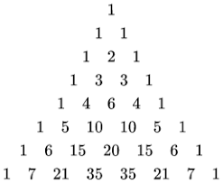

#maths/pure-maths/standard-functions/choose
A binomial is a polynomial with only two terms, and is then of the form $(a + b)$

## Pascal's Triangles
When exponentiating a binomial, the power that the binomial is raised to is the level of the pascal's triangle that corresponds to the coefficients of the terms.

From this, we can attempt to turn this into a tangible formula, resulting in the below formula, called the *choose* function:

$$\begin{pmatrix}n\newline r\end{pmatrix} = \frac{n!}{r!(n-r)!}$$

The function on the left, also notated as $^nC_r$, produces the coefficients of the pascal's triangle, where $n$ is the power / layer of the triangle (0 is at the top), and $r$ is the column of the row in the triangle (0 is on the left). This can then be put together into the binomial theorem.

## The Binomial Theorem
$$(a+b)^n = \sum^n_{k=0}\begin{pmatrix}n\newline k\end{pmatrix}a^{n-k}b^k$$

The binomial theorem is good, but there is one major problem with it. The binomial theorem only supports $n \in \mathbb{N}$. 

## An improved binomial theorem
Given the shortcomings of the binomial theorem, can we make it better? Yes! There is a version of the binomial theorem that works only with binomials of the form $(1 + kx)^n, n\in\mathbb{R}, |kx|<\frac{1}{ |k| }, \in\mathbb{R}$. This is shown below:

$$(1 + kx)^n = 1 + nkx + \frac{n(n-1)}{2!}k^2x^2 + \frac{n(n-1)(n-2)}{3!}k^3x^3 + \dots + \frac{n(n-1)\dots(n-r+1)}{r!}k^rx^r$$

It is important to note that this is an infinite series, that often converges quickly. As such, in exams it is unusual to be asked for more than the first few terms.

## Expanding the use of the binomial theorem for $n\in\mathbb{R}$
There will be times when it is necessary to expand binomials of the form $(a+kx)^n$. It is in fact possible to transform this into being able to be used with the previous binomial theorem.

$$(a+kx)^n = (1 + \frac{k}{a}x)^n = 1 + n\frac{k}{a}x + \frac{n(n-1)}{2!}\frac{k}{a}^2x^2 + \frac{n(n-1)(n-2)}{3!}\frac{k}{a}^3x^3 + \dots + \frac{n(n-1)\dots(n-r+1)}{r!}\frac{k}{a}^rx^r$$

> **REMEMBER, THESE IMPROVED BINOMIAL EXPANSIONS ARE FOR $n \in\mathbb{R}$ NOT $a,b \in\mathbb{R}$. THAT APPLIES TO ALL OF THEM. 