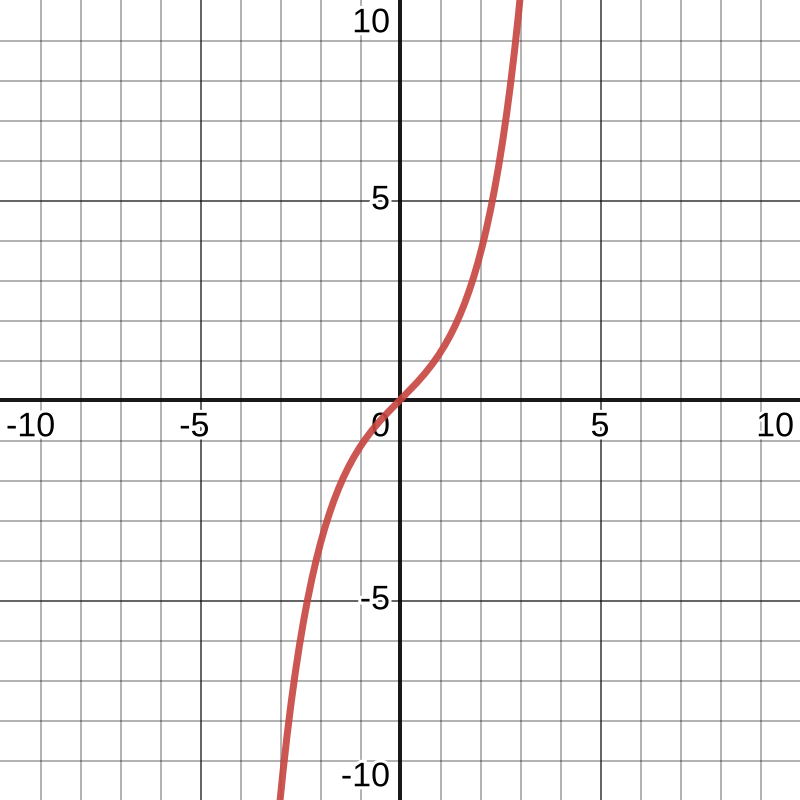
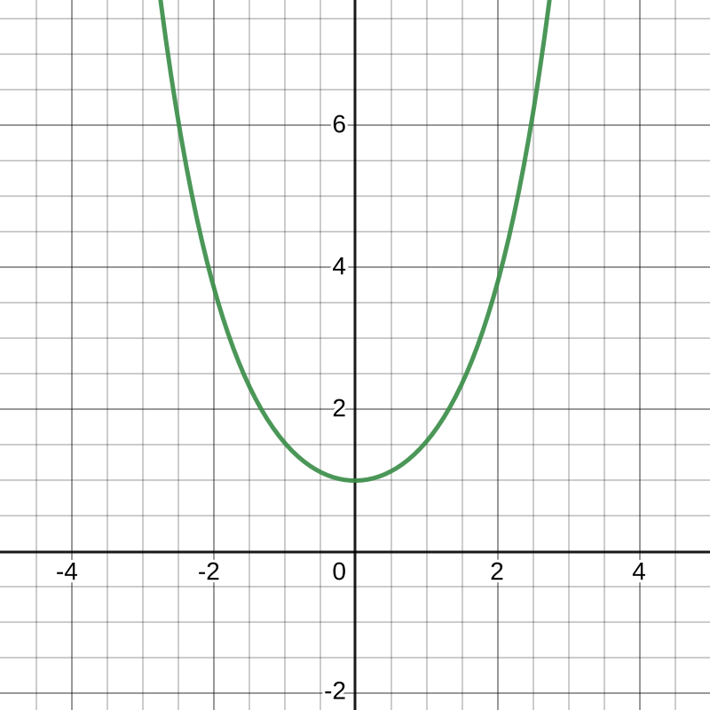
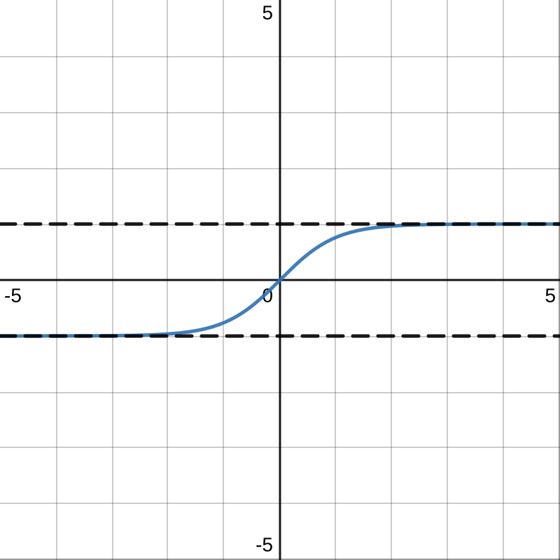

#maths/pure-maths/trigonometry
As a counterpart to the trig functions $\sin\theta$, $\cos\theta$ and $\tan\theta$, which operate on the unit circle, there are also three hyperbolic functions which operate on the unit hyperbola:
- $\sinh a$ (pronounced 'Cinch')
- $\cosh a$ (pronounced 'Cosh')
- $\tanh a$ (pronounced 'Tanch')
There are also three new inverse functions to go with these:
- $\text{arsinh}\space a$
- $\text{arcosh}\space a$
- $\text{artanh}\space a$
> Note, all inverse trigonometric functions may be abbreviated as follows:
> $\sin x = \text{asin}\space y$
> $\cos x = \text{acos}\space y$
> $\tan x = \text{atan}\space y$
> $\sinh x = \text{asinh}\space y$
> $\cosh x = \text{acosh}\space y$
> $\tanh x = \text{atanh}\space y$

### Defining these functions
Unlike the regular trig functions, which have a rather informal definition, these functions are precisely defined using other methods:
- $\sinh a = \frac{e^x - e^{-x}}{2}$
- $\cosh a = \frac{e^x + e^{-x}}{2}$
- $\tanh a = \frac{e^{2x} - 1}{e^{2x} +1}$

| $\sinh x$                           | $\cosh x$                           | $\tanh x$                           |
| ----------------------------------- | ----------------------------------- | ----------------------------------- |
|  |  |  |

Note that though $\sinh x$ looks like a cubic graph, it is not one, as the curves go up exponentially. Similarly, though $\cosh x$ looks like a quadratic, it is in fact not a quadratic. Also: $\tanh x$ also has pretty obvious asymptotes 

### Inverse Functions
These functions are provided on the formula sheet, and can be generally used, as they are much simpler than the alternative, however, be aware that as these are **FUNCTIONS**, they will only produce one answer. While this is sufficient for $\sinh$ and $\tanh$, as $\cosh$ is a [one-to-many function](../Graphs%20and%20Functions/Functions%20and%20Mappings.md), its inverse would not be a function. Thus, remember that the function supplied can be multiplied by +1 or -1 to get solutions.

### Osborne's Rule
As a general rule, excluding calculus, the identities for regular trig functions hold, except for one detail. Every instance of $\sin x$ must be replaced with $-\sinh x$.