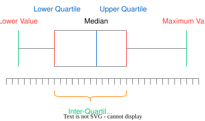

#maths/applied-maths/statistics #maths/pure-maths/graphing 
## Box plots
A quick recap of box plots  

## Outliers
In general, an outlier is a value that lies 1.5 Inter-quartile ranges beyond the upper and lower quartiles. If there is a deviation from this, it will be specified in the question.
It is important to note that in the case that the maximum or minimum value is an outlier, the outer lines represented on the box plot should be Upper/Lower Quartile $\pm$ 1.5 * IQR.
