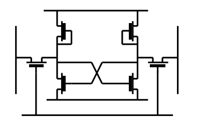

#hardware/memory #software/algorithms/parallel
### Types of Memory
- RAM (Random Access Memory) stores data temporarily and is wiped after a while when power is lost.
- ROM (Read Only Memory) stores data permanently, even when power is lost.
The timing here can be considered logarithmic, that is that ROM data will eventually decay, but that might be years without power, but the 'after a while' that RAM will last after losing power may be measured in nanoseconds.
##### DRAM
In general, memory can in essence be considered an analogue component. The only major exception to this are components such as JK/SR/T/D flip flops. The most common type of RAM is *dynamic RAM* (DRAM). This type of RAM abuses the capacitance of surrounding components to turn a single transistor into storage for a single bit.

To turn these into a larger block of memory, we can combine them in a grid, and select the bits we want to access by using the row and column select lines. The state of these lines can be determined by the memory address being read from / written to.
##### SRAM
SRAM is another type of memory made using a different configuration of transistors (see right). It is more commonly used to make caches located on-die. This is because, though it is physically larger than DRAM, it is also much faster, and doesn't decay in the same way the DRAM will, even when power is continually supplied. Much like DRAM, an individual cell of SRAM can be considered an analogue component, rather than a digital one.

##### Generic Memory Components
In a generic memory component, there are five major inputs/outputs.
- Data Address
	The place to read from / write to. This is often up to 64 bits wide.
- Data
	The data being read / written. This is often many, many bytes wide.
- Mode
	The switch between reading and writing
- Clock
	The clock on which all reads / writes occur.
- Enable
	Selects whether the chip is enabled / disabled, allowing for more memory to be addressed using less address lines.
When reading from a memory component, there may also be more access modes than just reading a number of bytes at a time.
- Conventional - Give address, get data.
- Wide IO - Give address, get more data than you bargained for. Useful when you want more data than there are pins on the memory chip. This means you can get more of it in one go.
- Sequential Mode - Give address, keep getting data. Once a memory read occurs to an address, more data is read, continuing sequentially (like reading an array), lowering the access times.
- DDR (Double Data Rate) - Data is sent and received on both edges of the clock.
### Registers
Generally, registers are made using JK flip-flops, rather than using DRAM, as it is much faster and has almost zero latency. By putting these together, we make registers.
### Amdahl's Law and the Principle of Locality
**Amdahl's Law:**
The performance improvement to be gained by using some faster method is limited by the amount of time that you can use the faster method.
**Principle of Locality:**
"Real" programs spend 90% of their execution time in 10% of the code. As the most likely instruction that needs to be executed is the one in the memory after the current one, we can use a smaller, but faster piece of memory to store code, and get a significant speed increase, with the downside of paying a high price when the program needs to execute some code not in the 10%.
### Caching
In processors, multiple caches are used to contain portions of main memory to bring data closer (physically and timing-wise) to the processing cores. This allows for lower-latency access of frequently used data. When some data needs to be loaded, but it is not in the L1 cache (the lowest level), it will be promoted to L1 from L2. If it's not in L2, then it'll be promoted from L3. Again if not in L3 (the highest level of cache), then promoted from system RAM. When some data is promoted to a lower level of cache, it is important to note that it is both copied to that higher-level of cache as well as sent straight to the CPU. This can take place in parallel, as sending the data to the CPU is much faster than doing the memory copy between caches.

##### Cache Structure
A system's main memory is comprised of a number of *blocks*, each containing some number of *words* (usually a power of 2). On the other hand, a system's cache is generally comprised of *cache lines*, containing the same number of *words* as in a block from main memory. Because there are many more blocks of main memory than there are of cache (this would defeat the point of a cache), each cache line needs a method to refer back to the portion of main memory that it is mirroring. Using this, it's simple to look up some memory in cache, as we only need to concern ourselves with a single address that would work in main memory.
### Multiprocessing
##### Symmetric Multiprocessing
Symmetric multiprocessing is where there may be individual systems or processors connected to a shared cache. Each processor may also have its own smaller caches for just the data that it is working on at the time. Usually this processors must also be controlled by some *main bus* or using some operating system level control bus.

##### Clusters
Groups of computers using the symmetric architecture may be clustered together, and linked via a shared main bus. However, it is important to note that the cache (the L3 cache in the diagram above) is not shared, only the main bus, some shared secondary storage and potentially an operating system controlled bus. Otherwise, these symmetric nodes are disconnected. To connect the main busses of each node may also use one of several different methods. Commonly something akin to a network switch might be used, but a clique (think of a graph with all nodes connected to all other nodes) or cycle may also be used
##### Non-Uniform Memory Access (NUMA)
Non-Uniform Memory Access refers to the architecture where each chip/processor/system has its own caches and memory. Each chip then deals primarily with data in its own memory, but if it needs data from another system's memory, then it must request it over the main bus. Due to this, the access times may vary wildly between accessing two pieces of data that are both 'in main system memory', as one may require a hop over the system bus to acquire.
##### Uniform Memory Access (UMA)
Uniform Memory access is much like NUMA, however, instead of having a main system bus, we replace it with a shared system memory, supplying each individual chip with more cache to compensate. This allows for all reads from main memory to take the same amount of time, but does add in the possibility of race-conditions and use-after-free errors. It is for this reason that UMA is less widely used than NUMA.
### Traditional Secondary Storage
Aside from the RAM types talked about so far, there are of course other types of storage.
- SSDs
	High-density flash storage that leans even further into the analogue nature of memory cells. By dividing the voltage range that a cell may store, more bits can be encoded per cell. In modern SSDs, each memory cell will usually store three or four bits. The reliability of SSDs and other NAND flash storage media is significantly lower than that of other storage methods, leading to most commercial SSDs having *overprovision*. That is, when you buy a 1TB SSD, you actually get 1.25TB, and the extra storage is used when the storage left has degraded.
- HDDs
	Data is stored on one or more *platters*, which are disks made of many small magnetic cells, that can have their polarity flipped. To read/write a small head hovers over the disk(s) on a small boundary layer of air or pure nitrogen. When storing data on a HDD, it must be placed into the right portion of the disk(s). This is denoted by the offset into a sector, which is part of a track (a ring on a disk), which makes up cylinders, which stack tracks between disks to increase storage density.
- Optical Media
	- CD
	- DVD
	- Blu-Ray
	Data is stored in 'pits' and 'lands' (high and low areas on the disk) and a laser is shined onto these areas, and depending on where the reflected light focusses, a bit is given. The size of these pits and lands directly depends on the wavelength of the laser. Thus, shorter wavelength lasers allow for disks with higher data densities. Storage densities can be further increased by making the disk double-sided.
- Magnetic Tape
### ROMs
Read-Only Memory is a type of memory that can be written once, at the factory or via some slow process and then read quickly. The data stored on a ROM is non-volatile, so it will be preserved if power is lost. The common types of ROM that are used today are:
- Mask programmable ROM (maskPROM)
- Programmable ROM (PROM)
- Erasable Programmable ROM (EPROM)
- Electrically Erasable Programmable ROM (EEPROM)
These types of ROM are not technically memory, as their method of storing data actually creates a combinational circuit that takes some input (an address) and transforms it into some output (the data).
##### 1-Hot
A collection of wires can be considered '1-hot' if only one of them will be pulled high at a given time. It is possible to convert from a more compact signal to a 1-hot signal, but the number of wires required will be $2^n$, where $n$ is the number of wires in the signal being converted from. Some [state machines](State%20Automata.md) may use 1-hot signals as their state labels, allowing for the use of no decode logic.
From a 1-hot signal, it is easy to conceive of a design for some memory block, where each one is enabled by one line of the 1-hot signal. Using this method allows for the elimination of a clock signal entirely.
