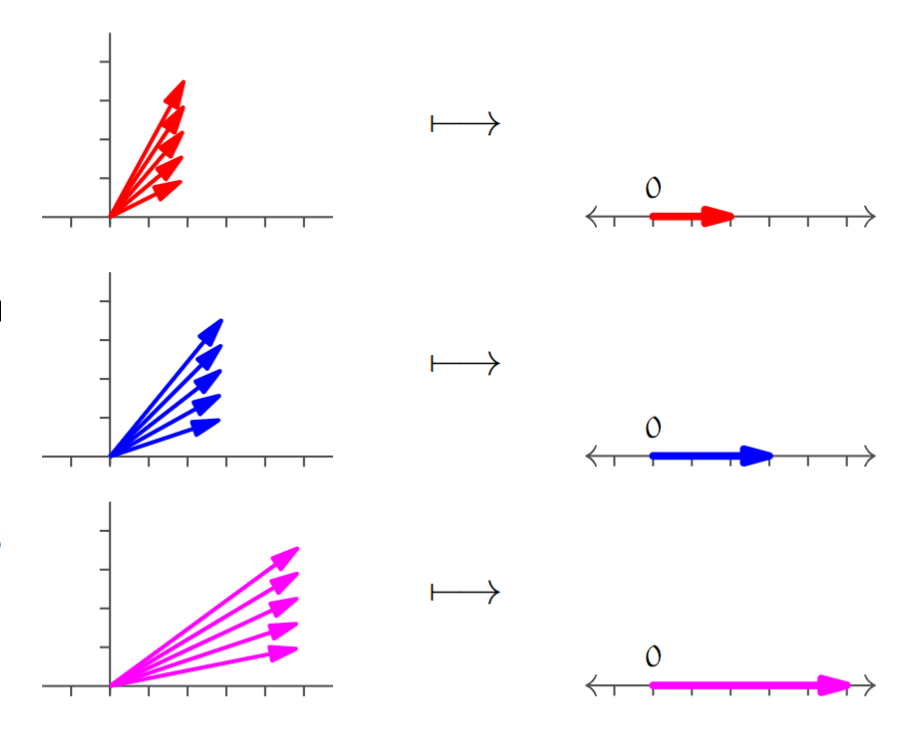

#maths/pure-maths/set-theory 
At a high-level two sets can be considered 'equivalent'. For example, $\mathbb{R}^2$ (2D Euclidian Space) and $\mathcal P_1$ (First order polynomials). Take $\begin{pmatrix}1\\2\end{pmatrix}$, for instance is 'equivalent' to $1 + 2x$. It's not just that this relation preserves the 'look' of the vector, but it also preserves the structure of the vector space. That is, adding two vectors in $\mathbb{R}^2$ will give a vector that is 'equivalent' to the one in $\mathcal P^1$ gotten by adding the equivalent vectors. Further multiplying by a scalar will also preserve the 'equivalence' of the vectors. This kind of relation is called an *isomorphism*. More specifically, an isomorphism is a [relation](../Logic/Relations.md) between two vector spaces that exhibits the following properties:
- It is [bijective](Functions.md#Types%20Of%20Function)
- It *preserves structure*
	- $f(\overrightarrow{v_1}+\overrightarrow{v_2}) = f(\overrightarrow{v_1}) + f(\overrightarrow{v_2})$
	- $f(c\cdot\overrightarrow{v}) = c\cdot f(\overrightarrow v)$
When two vector spaces are isomorphic, we can notate it using $\cong$. For instance, using the example above, $\mathbb{R}^2 \cong \mathcal P^1$. To verify an isomorphism, you must prove both of the properties listed above.

It is important to note that though many relations between two vector spaces may conform to the first requirement or only part of the second, the preservation of structure is much rarer and can be considered 'special'. For instance, $f(\begin{pmatrix}x\\ y\end{pmatrix}) = \begin{pmatrix}x^2\\ y^2\end{pmatrix}$ does not preserve structure under vector addition.
##### Automorphisms
An automorphism is an isomorphism between a vector space and itself. Three common automorphisms are *dilation* maps (scaling maps), *rotation* maps and *reflection* maps.
##### Theorems, Lemmas and Corollaries
- An isomorphism will always map some $\text{Rep}_\mathcal{V}(\overrightarrow 0)$ to $\text{Rep}_\mathcal{W}(\overrightarrow 0)$ (zero vectors map to themselves.)
- Assuming that $f$ is an automorphism, the following statements are equivalent:
	- $f$ preserves structure
	- $f$ preserves linear combinations of two vectors
	- $f$ preserves linear combinations of any finite number of vectors
- The inverse of an isomorphism is also an isomorphism
- Isomorphisms are an [equivalence relation](../Logic/Relations.md#Equivalence) between vector spaces
- Vector spaces are isomorphic if and only if they share the same [dimension](../../Linear%20Algebra/Linear%20Independence.md#Dimension).
- Each finite-dimensional vector space is isomorphic to one and exactly one of the family of vector spaces $\mathbb{R}^n$.
### Homomorphisms
A homomorphism (or linear map) is a relation between two vector spaces that preserves addition and scalar multiplication (in the same way an isomorphism would). Much like isomorphisms, two of the lemmas above apply, specifically the first two. Using these (generally the second), we can prove that some map between two vector spaces is or is not a homomorphism.

A homomorphism is uniquely identified by its effects on the basis vectors of the vector space it transforms from. Using this, we can extend linearly any function $f: \mathcal B \to \mathcal W$ to $\hat f:\mathcal V\to\mathcal W$, where $\mathcal V$ and $\mathcal W$ are vector spaces, and $\mathcal B$ is the basis of $\mathcal W$.
> [!example]- $\mathbb{R}^2\rightarrow\mathbb{R}^2$
> Consider a homomorphism that maps the basis vectors $\langle \begin{pmatrix}1\\2\end{pmatrix}, \begin{pmatrix}1\\0\end{pmatrix}\rangle$ to the new basis vectors: $\langle \begin{pmatrix}1\\3\end{pmatrix}, \begin{pmatrix}2\\0\end{pmatrix}\rangle$.
> The effect of any vector $\overrightarrow v$ in $\mathbb{R}^2$ is then determined by this relationship. We can see this by writing the vector $\overrightarrow v$ in terms of its basis and using the fact that homomorphisms preserve linear combinations of vectors to transform it by the relation.
> $\begin{pmatrix}-1\\5\end{pmatrix} = 5\cdot\begin{pmatrix}1\\1\end{pmatrix}-6\cdot\begin{pmatrix}1\\0\end{pmatrix}\implies h(\overrightarrow v) = h\left(5\cdot\begin{pmatrix}1\\1\end{pmatrix}-6\cdot\begin{pmatrix}1\\0\end{pmatrix}\right) = 5\cdot\begin{pmatrix}1\\3\end{pmatrix}-6\cdot\begin{pmatrix}2\\0\end{pmatrix} = \begin{pmatrix}-7\\15\end{pmatrix}$

A *linear transformation* is any map from a space to itself. For example the identity map $\text{Id}$ is always a linear transformation. Similarly, a map that reflects about a line or plane would be another example of a linear transformation. The set of all linear transformations also happens to form a [vector space](../../Linear%20Algebra/Vectors.md#Vector%20Spaces).
> [!example] $f, g:\mathcal P_1 \to \mathbb{R}^2$
> $$
> f(a + bx) = \begin{pmatrix}a + b\\0\end{pmatrix}\hspace{35pt} g(a + bx) = \begin{pmatrix}4b\\ b\end{pmatrix}
> $$
> We can combine $f$ and $g$ into a single function $(2f + 3g)$, where 
> $$
> (2f+3g)(a+bx) = \begin{pmatrix}2a + 14b\\ 3b\end{pmatrix}
> $$
> Checking that this is also a homomorphism is the same process as would be used for any other  

Under a homomorphism, the image of some subspace of the domain is some subspace of the codomain. Further, an image of the whole domain may be a subspace of the codomain. For instance, a homomorphism from $\mathbb{R}^2$ to $\mathcal M_{2\times 2}$, may when given the $x$-axis the subspace of the domain result in a particular set of $2\times2$ matrices that form a subset of the codomain. An example of a homomorphism from a set to itself would be rotation by an angle $\theta$. For a given line in $\mathbb{R}^2$ through the origin, (the subspace of the domain), another line in $\mathbb{R}^2$ through the origin will be the subspace of the codomain. 
##### Range Space
The *range space* of a homomorphism $h$ (denoted by $\mathfrak{R} (h)$) is the range of the homomorphism, parameterised as far as possible. 
> [!example] $\mathcal{M}_{2\times2}\to\mathbb{R}^2$
> Consider the homomorphism $h:\mathcal{M}_{2\times2}\to\mathbb{R}^2$, where $h$ is
> $$
> h: \begin{pmatrix}a&b\\ c&d\end{pmatrix}\to\begin{pmatrix}a\\2a\end{pmatrix}
> $$
> The range space $\mathfrak{R}(h)$ of this homomorphism is $\left\{\begin{pmatrix}a\\2a\end{pmatrix}|a\in\mathbb{R}\right\}$ and the [rank](../../Linear%20Algebra/Vectors.md#Row%20Space,%20Column%20Space%20and%20Transposes) of this range space is one (there is only one linearly independent row / only one variable needed to convey all the 'information' encoded by the vector)

Due to the definition of the range space of a homomorphism, we can see plainly that all homomorphisms are [surjective](Functions.md#Surjective%20Function) onto their range space, just as isomorphisms are surjective onto their codomain (which is also their range space). In this way, dropping the requirement for isomorphisms to be surjective as part of the definition of homomorphisms has no real change on the set of possible outputs. On the other hand, dropping the requirement that isomorphisms also be [injective](Functions.md#Injective%20Function) *does* change the mappings produced, in that they go from being a required *one-to-one* to in some cases being *many-to-one*. This feature of homomorphisms, that they facilitate many-to-one relationships between vectors allows us to use a homomorphism to classify parts of a vector space.
To get the sets of these 'classes' of vectors, we simply take the inverse of the homomorphism. For example, the homomorphism $h$ will have an inverse homomorphism $h^{-1}$. From this we say that $h^{-1}(\overrightarrow w) = \left\{\overrightarrow v\in\mathcal V\space|\space h(\overrightarrow v) = \overrightarrow w\right\}$. 
> [!example]- $\mathbb{R}^2\to\mathbb{R}$
> Let $p:\mathbb{R}^2\to\mathbb{R}$, where $\begin{pmatrix}x\\ y\end{pmatrix}\mapsto x$. Under this function, we have the notion of '2-vectors' are any vector $\overrightarrow v$ such that $p(\overrightarrow v) = 2$. Similarly, '3-vectors' map to 3 and '5-vectors' to 5 and so on. This visual intuition allows us to more precisely see the way in which structure is preserved. Adding a '2-vector' to a '3-vector' will always get us a '5-vector'. Multiplying any '2-vector' will always give a valid '4-vector' is similarly easy to visualise. More formally, $p(\overrightarrow u) + p(\overrightarrow v) = p(\overrightarrow u + \overrightarrow v)$ and $n\cdot p(\overrightarrow v) = p(n\overrightarrow v)$, meaning that the addition of vectors in range-space is preserved in exactly the same way they are in the domain.

>[!example]- $\mathcal P_2\to\mathbb{R}^2$
>The same notions seen in the above example can be applied to vector spaces that aren't so easily visualised though.
>Let $h: ax^2 + bx + c \mapsto \begin{pmatrix}b\\ b\end{pmatrix}$
> Then consider some vectors $\overrightarrow v_1, \overrightarrow v_2, \overrightarrow v_3$ such that $h(\overrightarrow v_1) = \begin{pmatrix}1\\1\end{pmatrix}$, $h(\overrightarrow v_2) = \begin{pmatrix}-1\\-1\end{pmatrix}$, $h(\overrightarrow v_3) = \begin{pmatrix}0\\0\end{pmatrix}$. We can know then that the inverse image of $\overrightarrow v_1$, $\overrightarrow v_2$ and $\overrightarrow v_3$ are the set of quadratic polynomials with the x-coefficient of 1, -1 and 0 respectively. Seeing that the addition of the quadratics or their multiplication with a scalar value results in another polynomial in the range space of the inverse of the homomorphism ($h^{-1}$).
##### Null Space
The *null space* (also known as the *kernel*) of a homomorphism ($\mathcal{N}(h)$) is the *reverse image* of the zero vector in the vector space containing the range of the homomorphism. More formally,
$$
\mathcal{N}(h) = h^{-1}\left(\text{Rep}_{\mathcal{W}}(\overrightarrow 0)\right) = \left\{\overrightarrow v\in\mathcal V\space|\space h(\overrightarrow v) = \text{Rep}_{\mathcal{W}}(\overrightarrow 0)\right\}
$$
Less formally, the null space of a homomorphism can be thought of as the set of values in the domain that are mapped by the homomorphism to the zero vector in the range. The [dimension](../../Linear%20Algebra/Linear%20Independence.md#Dimension) of the null space of a homomorphism is known as the homomorphism's *nullity*.
> [!important] Theorem: $\text{Dim}(\mathcal{N}(h)) + \text{Dim}(\mathfrak{R}(h)) = \text{Dim}(\mathcal{V})$
> The rank of the range of a homomorphism plus the nullity of the homomorphism is equal to the dimension of the homomorphism's domain. 

##### Linearly dependent sets
Under a homomorphism, a [linearly dependent](../../Linear%20Algebra/Linear%20Independence.md) set will always produce another linearly dependent set.