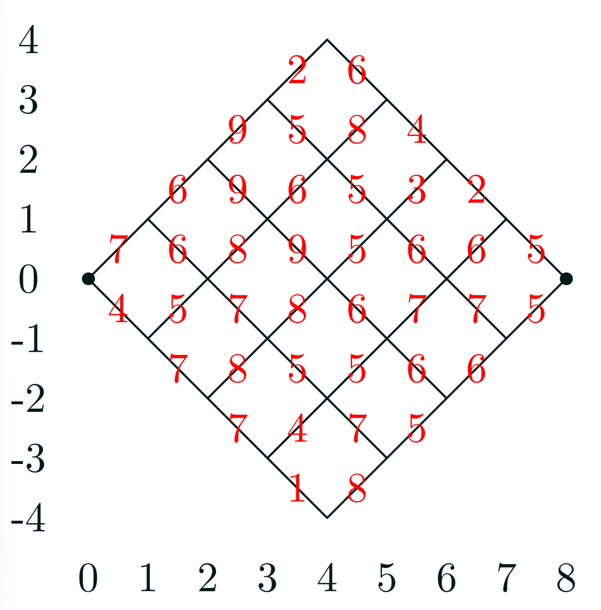
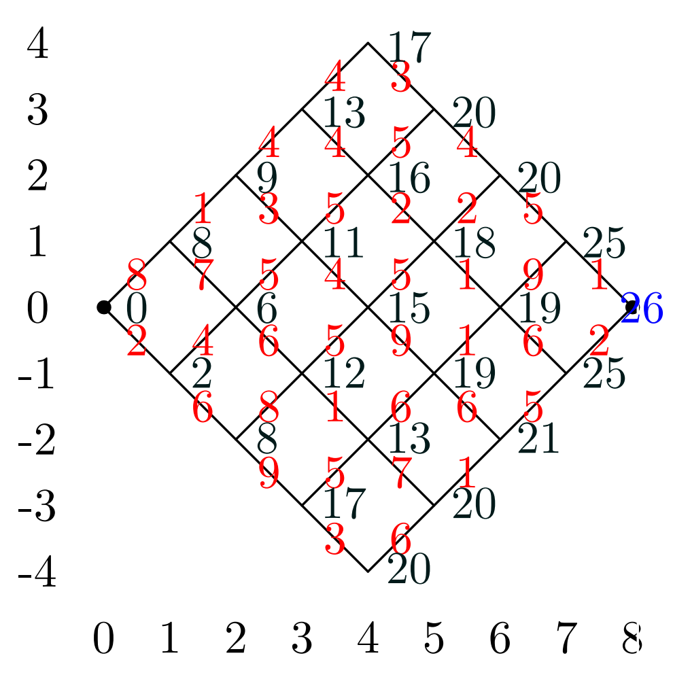

#software/algorithms
Despite using the word programming in the name of the technique, this method has very little to do with actual programming. It _is_ more closely related to [linear and quadratic programming](../../AICE1008%20Maths%20for%20AICE%20(2)/Optimisation/Optimisation.md#Programming) in the sense that the purpose of all three methods is to optimise something. Where the former produce solutions 'all at once', dynamic programming produces solutions that are formed 'one step at a time'. This can be thought of as being because in linear and quadratic programming, there is no sense of time, the whole system must be balanced at once. In dynamic programming, the choices you can make at any given time depend on the choices you have already made, which in and of themselves are solutions to smaller problems than the one you are solving. In short - *dynamic programming can be used when we know that the solution to a problem contains in some way the solution to only part of the problem.* 

> [!important]
> The actual nuts and bolts of any dynamic programming solution are usually specific to that particular problem, but they all follow the same general outline:
> We start with a **large set of small partial solutions** (solutions to only very small versions of the problem) and **combine them together** to get a smaller set of slightly larger partial solutions. We continue this process over and over until the set of partial solutions has size one, at which point **the sole remaining partial solution is actually the global solution**
### Example Problems
##### Lattice Traversal
Imagine that we have some diagonal lattice, as seen to the right. Each link between vertices in the lattice has some cost associated with it and we want to move from the left-most vertex to the right-most. As should be plainly obvious, the cost of any given path is the sum of the costs of the links it traverses. Solving this problem via brute force is infeasible for large lattices, as the solution space grows exponentially. For instance, this problem with $n=8$ has 70 paths, but with $n=100$, there are approximately $1\times 10^{29}$ solutions.
To solve this problem using dynamic programming, we consider the shortest path to all vertices. For any given vertex the shortest path to it is either from the vertex to the left and up, or to the left and right. Thus, the cost of getting to this node is the minimum of the cost of the left and up node plus the cost of the link to this node or the cost of the left and down node plus the cost of its link. More mathematically:
$$
C(i,j) = \min\left[C(i-1, j+1) + W((i-1, j+1), (i,j)) , C(i-1, j-1) + W((i-1, j-1), (i,j))\right]
$$
Where $C(i,j)$ is the minimum cost to get to the vertex at $i, j$ and $W((a,b),(c,d))$ is the weight of the link between the vertices at $a,b$ and $c,d$.
 This gives us the minimum cost to get to every point on the lattice. From here, we traverse backwards from the end to the start. To choose which direction to go, we simply choose the node where its minimum weight plus the cost of its link to the current node is equal to the minimum cost of the current node. That is, using the example to the left, we would go left and up, as 25 + 1 = 26, and not down because 25 + 2 != 26.  We then repeat this until we get back to the start node. Then, the path we traced is the optimal path.

Because we had to compute the costs of every lattice point, we performed $O(n^2)$ operations there, and $O(n)$ operations to move through the lattice. This is significantly better than the $O(2^n)$ operations to perform the brute force solution.
##### Line Breaking
If we have some piece of text and we want to print it, we have some maximum line length each line of text can be before it begins to spill over the page. However, we also want the lines to be roughly equal in length. While we could use a greedy algorithm of trying to fit as many words onto a line as possible, this could result in lines that are very empty due to long words. Thus, we are left with an optimisation task - place the line breaks such that we minimise the empty space left at the end of the lines.
To do this, we define a cost function (called badness), where for some continuous range of words (say words 12 to 19 for example) the cost is the number of characters left after fitting them all onto a line together, taking into account spaces between words, cubed. We also define sequences of words that are too long to have a badness of infinity.
Then, we define the recurrence relation inherent to all dynamic programming solutions. We say that $dp_j$ defines the minimum cost for correctly formatting words 0 to $j$. We can then calculate $dp_j$ to be equal to $\min_{i=0}^{j}(dp_{i-1}+badness(i\rightarrow j))$. That is, the minimum cost for correctly formatting the words up to word $j$ is equal to the minimum of the cost for formatting the words up to some word $i$ plus the badness of the words from $i$ to $j$. We can then calculate this for all words $j$. After this, we can simply backtrack through $dp$, finding where the algorithm decided to put the breaks.

In practice, the algorithm is more complicated than this, as it may take into account hyphenations, large gaps or other undesirable things.
##### Edit Distance
Another use of dynamic programming is to find the 'edit distance' between two sequences, given a set of operations. This is useful when attempting to do 'fuzzy finding', where inexact matches may still produce valid results.
##### Djikstra's Algorithm
