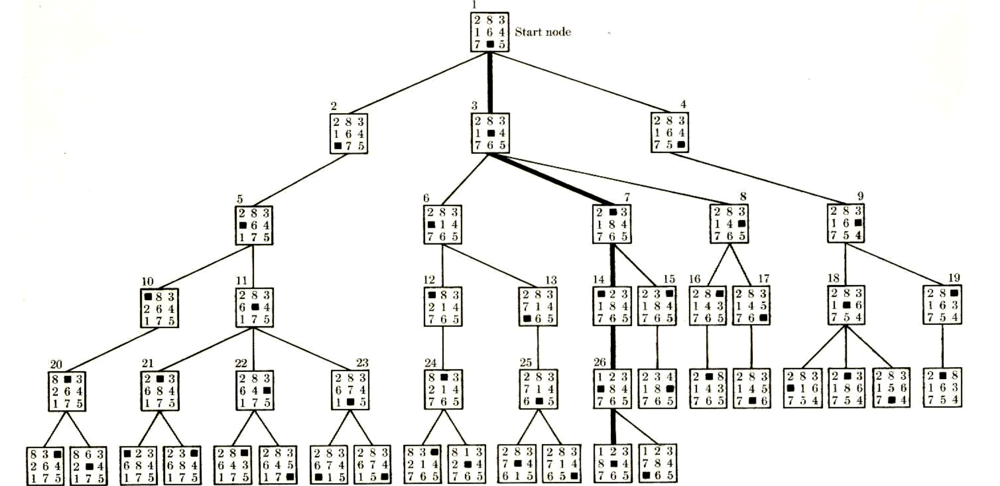

#software/algorithms 
### Search Trees
A common problem is where we have a system, with an associate state space, where we can get from one state to another by performing some set of actions. We know where we want to be, or perhaps just some set of conditions for a place we want to be, but we don't know how to get there, so we must search for a route.

>This is the state space of a game where we can swap the black square with one adjacent number, and we want to get to a state where the numbers are in ascending clockwise order. The bold route is the shortest route to the goal state.

The search space of a problem is generally very, very large as they usually increase exponentially with problem size. The example above of an 8-game has a fairly small search space, so could be easily solved by using a depth-first traversal, but in a more complex scenario, that could quickly become infeasible. Despite this, we still want to solve these types of problems.
### Backtracking Implementations
The most common way of solving these kinds of problems is to employ a version of depth-first search called *exhaustive enumeration*, where we go as far as we can, until we can no longer find any states we can get to that continue to satisfy the constraints imposed upon us.

An example of this is the solving of the 4-Queen problem (right). This is a problem where, on a 4x4 chessboard, to place four queens such that none are attacking any other. To solve this, we could work row-by-row. We first try placing a queen in the top-left cell, then look on the next row for where we can place queens, which is on the third and fourth ranks. Only on the fourth rank can we see any possible next moves, so there we continue. When we can't find any more possible solutions, we then backtrack up the state tree to find the last place where there are unexplored possible solutions, which happens to be the root node.

To solve this problem, we could easily model it using a recursive function, which finds possible solutions, given some set of constant constraints, like for instance the number of queens, some set of changing constraints - the current state we are at and the place we are in the search.

Another similar problem that this method is commonly used on is finding Hamiltonian cycles - we make some decisions, when they go wrong, we backtrack and try again.
### Branch and Bound Implementations
There are lots of problems where there is a monumentally huge search space, so we want to use a quicker algorithm than an exhaustive enumeration. However, often, these sorts of problems don't have many *hard* constraints. However, they can have solutions that can be 'scored'. This allows us to prune the search tree if we find points on the tree where it is impossible to get a better score than the current best. Thus, we can do fewer comparisons.
Thus, we use a strategy called *branch and bound* - it's often quite good at optimisation problems, and like an exhaustive enumeration performs better when there are more constraints, but can be shorter because we eliminate more possibilities in the optimisation problems it is best suited to early. 
Fundamentally, this is just a modified version of the backtracking behaviour found in exhaustive enumeration, but we are able to begin backtracking earlier. This is because we keep track of a 'score' for each solution we find. If we are ever at a partial solution where continuing to build it into a full solution would increase the score beyond the best full solution we have, we backtrack immediately and explore alternative options.
##### Optimising the travelling salesman problem
###### The naïve approach
One example of a problem we could attempt to optimise using branch and bound is the [travelling salesman](../Datastructures/Graph%20Theory.md#Hamilton%20Cycles%20and%20Travelling%20Salesman%20Problem) problem. Naturally, this solution, while guaranteed to give the optimal solution, does still not run in polynomial time.

Using the example map shown, we could begin by trying the solution
`0, 1, 2, 3, 4` This gives some minimum length any other solutions must be better than. Next, maybe we try `0, 1, 2, 4, 3`. As it happens, this is better than the former, so we update our upper bound to its length. We've run out of leaves on the tree, so we must backtrack up the tree and try another branch. Next we try `0, 1, 3, 2, 4`. This is not better than the bound, so again, we backtrack and try another combination of the last two elements. This process continues, checking permutations, if they are better then updating the best, otherwise backtracking. 
When we explore the tree to the `0, 3, 2` branch however, we see by the time we get to `0, 3, 2, 1` that it is too long already, so there is no point in checking `0, 3, 2, 1 ,4`, so we prune it from the tree and backtrack. Likewise, the same thing happens when checking `0, 3, 2, 4`. 
###### A more intelligent approach
The method shown above _is_ marginally better than an exhaustive enumeration, but not by much. This is because we just sent it, without doing any preparation to improve the performance of the algorithm. There are three major improvements we can make:
- Better cost function
	We can improve upon the cost function seen above - instead of taking into account just the length of the path we already have, we should also take into account the distance between the nodes still remaining somehow. To do this, we can make use of a minimum spanning tree, made from the remaining nodes. If we add the total distance covered by the tree to the cost, plus an extra cost for joining it to the start and end nodes of the path we've made, we can more accurately model the cost, preventing viewings of more poor combinations.
- Assumption of 2D Euclidian space
	In 2D Euclidian space, the lines in a TSP should never cross. As can be seen below, it is always better to not have the lines cross than it is to have them stay apart. Based on this observation, we can backtrack early if we detect this occurring. 
- Good starting bound
	In the first attempt, we started just with the first permutation we thought of. Instead, if we run a *greedy* algorithm on the map, we can get a solution that is, while not necessarily the best, always guaranteed to be not bad. Thus, we can begin eliminating branches much earlier in our exploration of the search space.
After adding all these improvements, the tree that we actually search is significantly improved: 
### Further Searching
Searching through possibilities in the ways outlined above are incredibly useful, especially in the study of AI. However, in practice, they are almost always too slow. For this reason, there are ways of further improving their speed.
- Alpha-Beta Pruning
- Minimax
- Better Heuristics
Despite these methods of improving on the solutions above, another commonly used method is to use methods which are perhaps a little more overzealous in pruning the tree and return very good, but not necessarily best solutions.