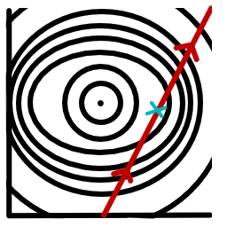

#maths/pure-maths/optimisation
To find a minimum value, we must first define some requirements on value ($\underline{x^*}$) we believe to be the minimum of some function $f(\underline{x})$.
1. $\underline{\nabla^Tf}(\underline{x^*})\cdot\delta=0\space\forall\delta$
	The gradient vector at the minimum value should be perpendicular to all direction vectors.
2. $\underline{\nabla f}(\underline{x^*}) = \underline{0}$
	The gradient vector must be the zero vector.
To get these, we perform a Taylor expansion about the supposed minimum value, $\underline{x^*}$
$$
f(\underline{x})=f(\underline{x^*})+\underline{\nabla^Tf}(\underline{x^*})(\underline{x}-\underline{x^*})+\frac{1}{2}(\underline{x}-\underline{x^*})^T\mathbf{H}f(\underline{x^*})(\underline{x}-\underline{x^*})+\text{higher order terms}
$$
Where $\underline{\nabla^Tf}(\underline{x^*})$ is the gradient vector, transposed, and $\mathbf{H}f(\underline{x^*})$ is the matrix formed by taking the partial derivative of each component of the gradient vector with respect to each variable and packing it into a matrix, called the **hessian matrix**. 
$$
\underline{\nabla^Tf}(\underline{x^*}) = \begin{pmatrix}\frac{\partial f}{\partial x_1}\\\frac{\partial f}{\partial x_2}\\\vdots\\\frac{\partial f}{\partial x_n}\end{pmatrix}\hspace{24pt}\mathbf{H}f(\underline{x^*}) = \begin{pmatrix}\frac{\partial^2f}{\partial {x_1}^2}&\dots&\frac{\partial^2 f}{\partial x_1\partial x_n}\\\vdots&\ddots&\vdots\\\frac{\partial^2 f}{\partial x_n\partial x_1}&\dots&\frac{\partial^2f}{\partial {x_n}^2}\end{pmatrix}
$$
>[!example]- Calculating the 2-Term Taylor Expansion
>Let $f(\underline{x})=2x_1{x_2}^3+3x_2x_3+x_1{x_3}^3$, $\underline{x} = \begin{pmatrix}x_1\\ x_2\\ x_3\end{pmatrix}$
>$\begin{rcases}\frac{\partial f}{\partial x_1}&=&2{x_2}^3+{x_3}^3\\ \frac{\partial f}{\partial x_2}&=&6x_1{x_2}^2+3x_3\\ \frac{\partial f}{\partial x_3}&=&3x_2+3x_1{x_3}^3\end{rcases}\implies\underline{\nabla f}(\underline{x})=\begin{pmatrix}2{x_2}^3+{x_3}^3\\ 6x_1{x_2}^2+3x_3\\3x_2+3x_1{x_3}^3\end{pmatrix}$
>
>$\mathbf{H}f(\underline{x})=\begin{pmatrix}\frac{\partial^2 f}{\partial {x_1}^2}&\frac{\partial^2 f}{\partial x_1\partial x_2}&\frac{\partial^2 f}{\partial x_1\partial x_3}\\\frac{\partial^2 f}{\partial x_2\partial x_1}&\frac{\partial^2 f}{\partial {x_2}^2}&\frac{\partial^2 f}{\partial x_2\partial x_3}\\\frac{\partial^2 f}{\partial x_3\partial x_1}&\frac{\partial^2 f}{\partial x_3\partial x_2}&\frac{\partial^2 f}{\partial {x_3}^2}\end{pmatrix}=\begin{pmatrix}0&6{x_2}^2&3{x_3}^2\\6{x_2}^2&12x_1x_2&3\\3{x_3}^2&3&6x_3\end{pmatrix}$

From the Taylor expansion, we can also identify one further condition for $f(\underline{x^*})$ to be a minimum point: $\mathbf{H}f(\underline{x^*})>0$. Expanding this out, we can distil these conditions into a single inequality:
$$
f(\underline{x})>f(\underline{x^*})
$$where $\mathbf{H}f(\underline{x^*})$ must be positive semidefinite, ie. has eigenvalues that are all $\ge 0$. 
### Line Search
*Line Search* is a generalised algorithm for finding the minimum of some function. To do it, you start with a random point, find the gradient vector and draw a line in the direction of the gradient. Along this line, a cross section of the plot is taken, reducing the optimisation problem down to one dimension, a computationally simpler problem. From this, a new point is chosen and the process repeats, finding the gradient vector, taking a cross section and using that, smaller, optimisation problem to inform a further step towards the minimum.
##### Mathematical Definition
We take some search direction for a given iteration, $\delta_n$, such that $\underline{\nabla^Tf}(\underline{x_{n-1}})\cdot\delta_n\lt 0$. This ensures that he direction vector always points 'downhill'. Each iteration, the point chosen $x_n$ is determined by the following recursive formula: $\underline{x_n}\leftarrow \underline{x_{n-1}}+\beta\underline{\delta_n}$. We then determine $\beta$ by one of two processes. We determine $\beta$ by solving the following minimisation problem: $\min_{\beta > 0} f(\underline{x_{n-1}}+\beta\delta_n)$. As this is a one-dimensional problem, it is much easier to solve than the whole n-dimensional problem at once. If we set $\delta_n$ to always be the direction of steepest slope, ie. $\frac{-\underline{\nabla f}(\underline{x_{n-1}})}{||\underline{\nabla f}(\underline{x_{n-1}}||}$, then we call it the 'steepest decent' algorithm. If we further set $\beta$ to be a small constant value instead of the result of the 1D minimisation problem, we call it the 'adaptive algorithm'.