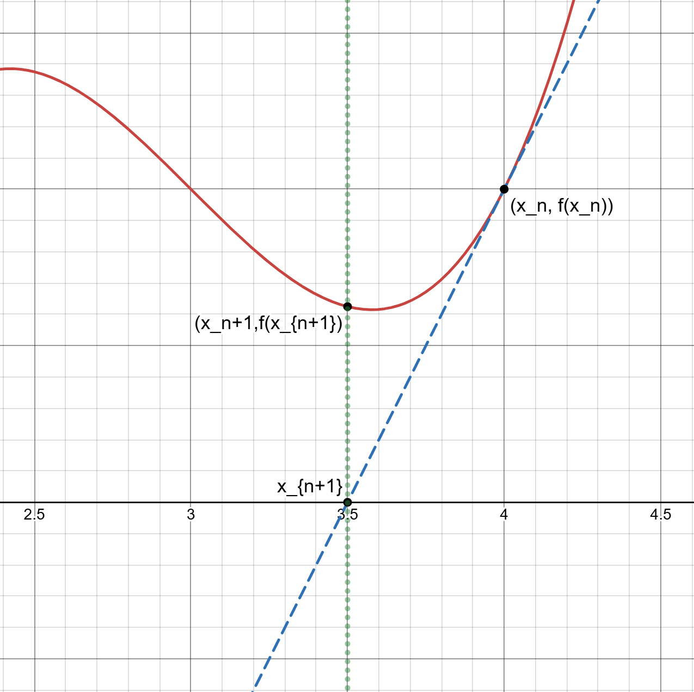

#maths/pure-maths/calculus #maths/applied-maths/error-minimisation
If given some function $f(x)$ with a known first derivative $f'(x)$, one method to approximate one root of the function is to use Newton-Raphson iteration, also known just as Newton iteration.

To perform newton iteration, pick some $x_0$ to use as a starting point. Then,
$$x_{n+1}=x_n-\frac{f(x_n)}{f'(x_n)}$$ Continue iterating this until it converges on a point. Note that this works poorly for functions that touch the x-axis rather than passing through it as the small gradients will prevent the iteration from converging at that root of the function.

### Derivation of the Newton-Raphson Formula
Given some function $f(x)$ and it's first derivative $f'(x)$, we can know that if we are at some point on the curve $(x_n, f(x_n))$ and the point after we perform an iteration of the formula should be $(x_{n+1}, f(x_{n+1}))$, we can say that:
$$f'(x_n) = \frac{f(x_n)}{x_n - x_{n+1}}$$
Rearranging this can give the formula simply from this point.
