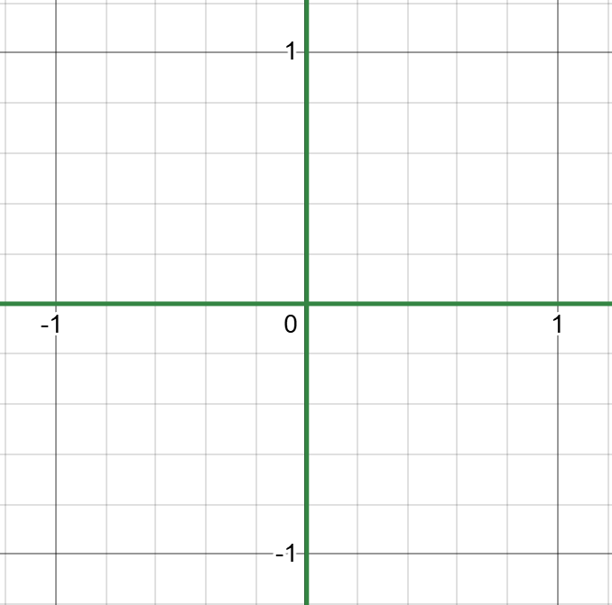
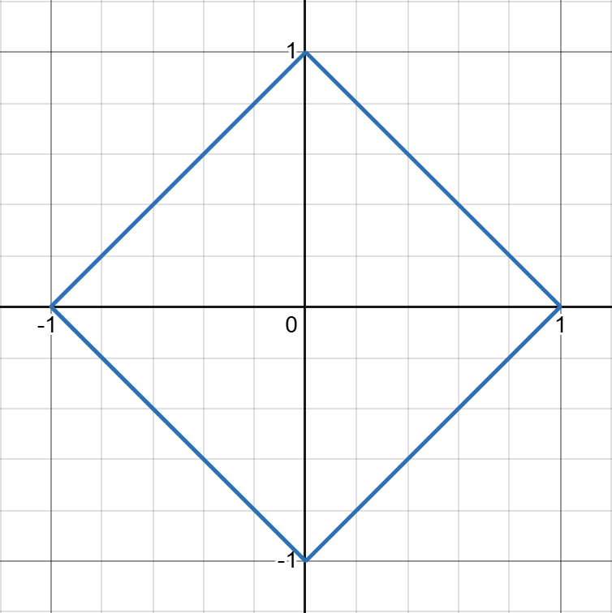
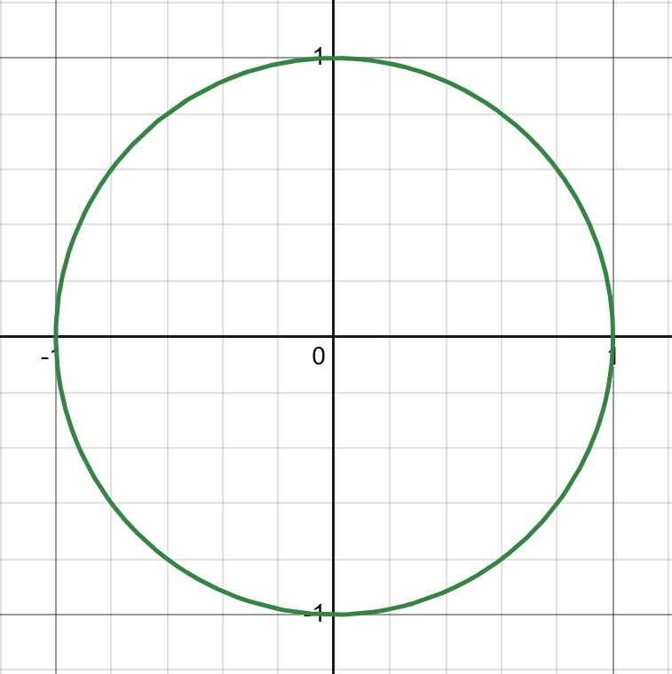
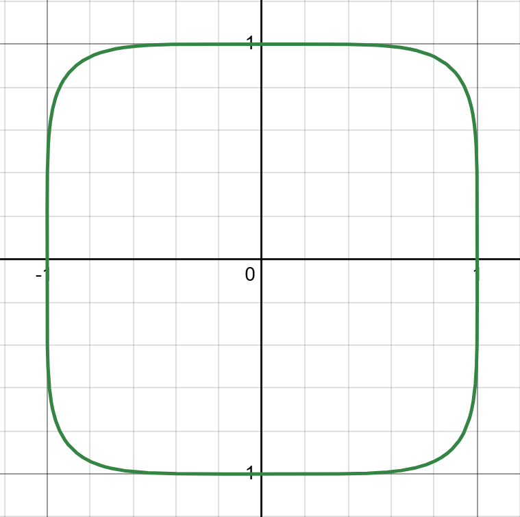
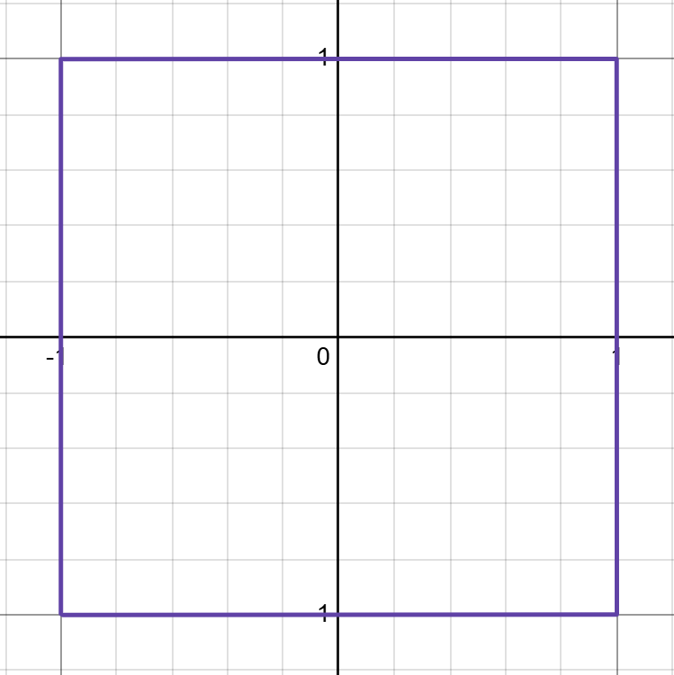

#maths/pure-maths/linear-algebra 
### Vector Norms
There are several different ways to normalise a vector:

| Name          | Equation                                                                           | Shape of norm=1               |
| ------------- | ---------------------------------------------------------------------------------- | ----------------------------- |
| 0-norm        | $\|\mathbf{x}\|_0 = \#[x_i\ne 0]\hspace{12pt}(\text{number of non-zero elements})$ |         |
| 1-norm        | $\|\mathbf{x}\|_1 = \sum^n_{i=1}\|n_i\|$                                           |         |
| 2-norm        | $\|\mathbf{x}\|_2=\left(\sum^n_{i=1}{x_i}^2\right)^{\frac{1}{2}}$                  |         |
| p-norm        | $\|\mathbf{x}\|_p=\left(\sum^n_{i=1}{x_i}^p\right)^{\frac{1}{p}}$                  |         |
| infinity-norm | $\|\mathbf{x}\|_\infty=\max_i(\|x_i\|)$                                            |  |
Looking at the graphical representations of these norms, it is relatively easy to see how they exist on a continuum and how the infinity-norm is the logical limit of the p-norm.

Each of these has uses, though the most commonly used norms are the 2-norm and infinity norm.
##### Properties of Vector Norms
Let $||\dots||$ be a norm, $\mathbf{x}$ and $\mathbf{y}$ are vectors and $k$ a scalar. For all norms:
- $||\mathbf{x}||_p \ge 0$ and $||\mathbf{x}||_p = 0 \iff \mathbf{x} = 0$
- $||kx||_p = |k|\cdot||\mathbf{x}|_p$
- $||\mathbf{x} + \mathbf{y}||_p\le ||\mathbf{x}||_p +||\mathbf{y}||_p$ (Triangle Inequality)
- $||\mathbf{x}||_p \ge ||\mathbf{x}||_{p+1}$
- 0 norm is not _really_ a norm
### Matrix Norms
There also exist norms for matrices which are called 'induced norms', as they rely on the same-numbered vector norm.
$$||A||_p=\sup_{x\ne0}\frac{||\mathbf{Ax}||_p}{||\mathbf{x}||_p}$$
> [!info]- Supremum
> The supremum, $sup$, of a subset $S$ of a partially ordered set $P$, in which between two elements a notion of 'greater than or equal to' is defined is the element of $P$ such that it is greater than or equal to all elements in $S$ and that there are no smaller elements of $P$ that are also greater than or equal to all elements in $S$ if such an element of $P$ exists. 
> 
> If such an element does exist, it will be unique and less than or equal to all upper bounds on $S$. (An upper bound is simply any value within $P$ that is greater than or equal to all elements of $S$.)
> 
> If there are no elements of $P$ not in $S$ that could be suprema, then the maximum value of $S$ must logically be the supremum of $S$.
> 
> In the same way that the maximum of a set can be notated as the maximum of a function that given some restrictions its domain may generate a range that the maximum of which is the result, the supremum of a function given some restrictions on the function's domain is the supremum of the range of the function given the specified domain.

It is possible to also rephrase the definition of the matrix norm without the use of suprema as the following:
$$||\mathbf{A}||_p=\max_{||\mathbf{x}||_p=1}||\mathbf{Ax}||_p$$
From the definitions of vector norms in the above section, we can get some simplified definitions of the matrix norm for specific values of $p$
- 1-norm
	$||\mathbf{A}||_1=\max_{||\mathbf{x}||_1=1}||\mathbf{Ax}||_1=\max_j\sum^n_{i=1}|a_{ij}|=\text{maximum column sum}$
- infinity-norm
	$||\mathbf{A}||_\infty=\max_{||\mathbf{x}||_\infty=1}||\mathbf{Ax}||_\infty=\max_i\sum^n_{j=1}|a_{ij}|=\text{maximum row sum}$
- 2-norm
	$||\mathbf{A}||_2=\max_{||\mathbf{x}||_2=1}||\mathbf{Ax}||_2=\sqrt{\lambda_{max}(\mathbf{A}^T\mathbf{A})}=\sigma_{max}=\text{singular value}$

There also exists another norm that exists exclusively for matrices that is not derived from the vector norms - the _Frobenius_ norm, $||\mathbf{A}||_F=\left(\sum^n_{i,j=1}{a_{ij}}^2\right)^\frac{1}{2}$
##### Properties of Matrix Norms
Let $\mathbf{A},\mathbf{B}$ are matrices, $k$ is a scalar and $\mathbf{x}$ is a vector:
- $||\mathbf{A}||_p \ge 0$ and $||\mathbf{A}||_p = 0 \iff \mathbf{A}=0$
- $||k\mathbf{A}||_p=|k|\cdot||\mathbf{A}||_p$
- $||\mathbf{A}+\mathbf{B}||_p\le||\mathbf{A}||_p+||\mathbf{B}||_p$ (Triangle Inequality)
- $||\mathbf{AB}||_p \le ||\mathbf{A}||_p\cdot||\mathbf{B}||_p$
- $||\mathbf{Ax}||_p\le||\mathbf{A}||_p\cdot||\mathbf{x}||_p$
If $\mathbf{A}$ is invertible,
- $||\mathbf{A}^{-1}||=\left(\max_{x\ne0}\frac{||\mathbf{A}^{-1}\mathbf{x}||}{||\mathbf{x}||}\right)=\left(\min_{x\ne0}\frac{||\mathbf{Ax}||}{||\mathbf{x}||}\right)^{-1}$