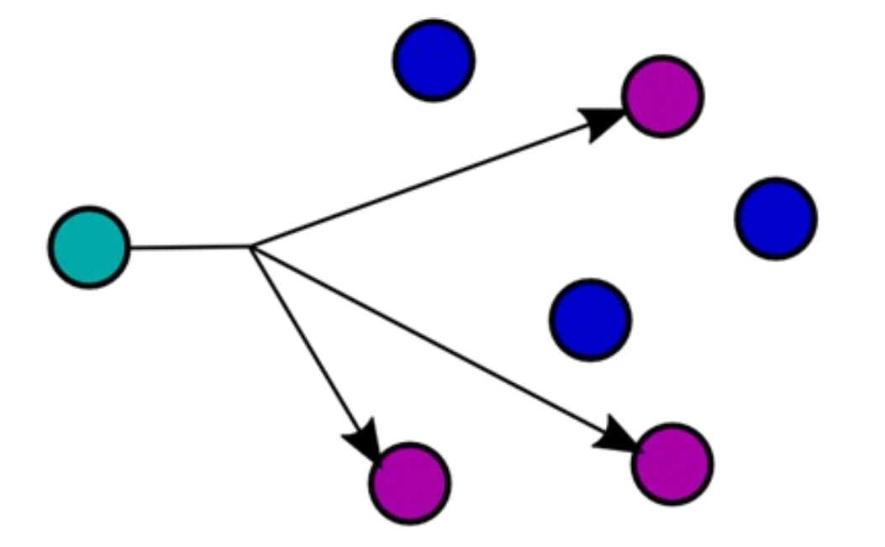

#software/networking/internet-layer
### Multicast

In IPv4, if one wanted to send the same packet to multiple recipients, the sender would need to duplicate the packet and change the destination addresses to each of the individual recipients. This is highly wasteful, when you could instead send it out once and have the packet be duplicated as late as possible. This means that on shared cable, we can save bandwidth. 

Though this feature does work on IPv4, it is a bit of an afterthought, whereas it is required for IPv6, where all multicast addresses can be found on `ff00::/8`[1](Internet%20Protocol.md#Reserved%20Addresses)

On IPv6, multicast is also highly scoped, so not only are specific IPs available to listen to for multicast, but they also can be scoped to specific network areas. 

| IP          | Scope                           |
| ----------- | ------------------------------- |
| `FF01::/16` | Interface-Local, like localhost |
| `FF02::/16` | Link-Local, not routed          |
| `FF04::/16` | Admin-Local                     |
| `FF05::/16` | Site-Local                      |
| `FF08::/16` | Organisation-Local              |
| `FF0E::/16` | Global Scope                    |
Though `FF0E::/16` does provide the option of global scope, this is almost never used, simply because nobody has thought of a good way to implement this for the whole internet. 