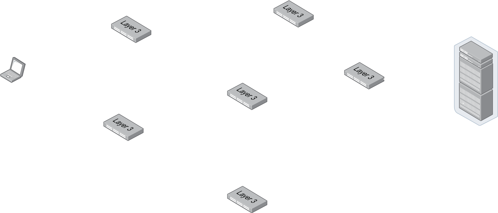

#software/networking/internet-layer
The internet layer is the second lowest layer, and wraps the transport layer. It has several functions:
- Packetisation of data
- The processing and routing of IP packets
- Fragmenting packets
- Error Checking
- Fragment Reassembly
There are several protocols that operate in this layer:
- IPv4 (data transmission)
- IPv6 (data transmission)
- ICMP (control)
- ICMPv6 (control)
- IPSEC (encryption/security)
- IGMP (IPv4 multicast groups)

The most important of these protocols are IPv4 and IPv6, the two versions of the 'Internet Protocol'. Though they fundamentally perform the same functions, there are some very important differences that need to be taken into account when using them.
### Similarities
Though there are many differences, there are especially at a high-level, plenty of similarities too. For example, they are both _connectionless_ (also known as fire-and-forget), that means that once a packet has been sent, that is it. The sender does not know if the receiver got it without them sending a message back. 

This unreliability means that there is no guarantee given that any packet will arrive; the sender will try their best, but if it doesn't arrive, it doesn't care. The dropping of packets is also not hugely rare, as they can be dropped for all sorts of reasons including congestion or all sorts of errors or faults. To combat this, TCP can handle retransmission of dropped packets (though UDP does not), though this is in the transport layer rather than the internet layer.
### Fragmentation
Each connection on a network has something called a _maximum transmission unit_ (MTU). This is the largest possible PDU (Protocol Data Unit - an umbrella term for packets, datagrams, segments, etc.) that can be carried across the link. If more data than can fit in an MTU needs to be sent, then the data must be split into multiple packets- this is called fragmentation. The exact details of how fragmentation is done is slightly different between IPv4 and IPv6. If this is not done, then generally, a network device with a smaller MTU than the packet is large will simply drop the packet.

Below is an example network, where a client (left) wants to send data to a server (right). To get there the data has to make several hops through switches with various MTUs. The MTU of a specific transmission is labelled in bytes next to the arrow pointing in the direction of data travel.

##### IPv4
In IPv4, a packet may be fragmented at any time. This means that unless the whole payload is larger than the MTU of the first hop, the packet isn't fragmented at all. Using the example above, regardless of whether the packet goes up or down at the first choice, if it is less than 1.5KB, including the header, then it will not be split. However, regardless of which route it then takes, as 1.5KB packet would then need to be split, as the following MTUs are all smaller than 1.5KB. This would involve the routers themselves splitting the packets into new ones that will fit the next hop.
Packets are not reassembled by any other switches, so the server may receive more packets than were originally sent by the client, regardless, they are reassembled into the payload at their destination. All IPv4 devices are required to be able to process packets up to 576 bytes (including all headers), so the MTU for IPv4 must always be larger than or equal to 576 bytes.

Alternatively, IPv4 can perform 'Path MTU discovery' by sending packets of increasing/decreasing size set with the 'do not fragment' flag. Then, when the packet encounters a device with an MTU smaller than its size, it will send an ICMP 'fragmentation needed' packet, which will help set the path MTU. This process is generally avoided on IPv4 as it is often very fragile and is often broken by misconfigured firewalls or tunnels that do not pass ICMP traffic.
##### IPv6
In IPv6, a packet may only be fragmented by the sender, not at any time. This means that if a packet is received by a piece of network equipment with an MTU too small to accept the packet, it is dropped, and the device sends back an ICMPv6 'Packet Too Large' message to the original sender. The original sender then must perform something called _Path MTU Discovery_ (PMTUD) to find what the largest allowable MTU is that will not need to be fragmented at any point along the transmission. This is given a lower bound of 1280 bytes - all devices with an MTU lower than 1280 bytes are not considered IPv6 compliant.
### Address Conventions
Both IPv4 and IPv6 provide addresses that are _supposed_ to be globally unique (see section: [Address Exhaustion](#Address%20Exhaustion). To do this, IPv4 utilises a 32-bit number, formatted as a series of bytes, written in decimal or hexadecimal, separated by dots. IPv6 utilises 128 bits, split into blocks of 16-bit 'octets', written in hexadecimal, separated by one or more colons.

| IP Version | Example Address                           |
| ---------- | ----------------------------------------- |
| IPv4       | `192.168.40.0`                            |
| IPv6       | `2001:0630:00d0:f500:0000:0000:0000:0064` |
##### IPv6 Address Simplification
Because IPv6 addresses are significantly longer than IPv4 addresses, they are obviously harder to remember as a human. To help alleviate this, IPv6 addresses can be simplified using two simple rules.
1. Omit leading zeros in a block
2. Replace a group of **two or more** blocks of all zeros with a double colon. This may only be done once, and by convention is done for the rightmost group for which this simplification is valid
> [!example] Simplifying an IPv6 Address
> Using the address in the table above:
> `2001:0630:00d7:f500:0000:0000:0000:0064`
> 
> Apply rule 1:
> `2001:630:d7:f500:0000:0000:0000:64`
> 
> Apply rule 2:
> `2001:630:d7:f500::64`

Because IPv6 addresses are of known length, and we can only apply the second rule once, and only in a specific place, it is always possible to expand a simplified IPv6 address into a full one. It is also important to note that IPv6 addresses are never stored or transmitted in a simplified form - the whole address is _always_ used, address simplification is _only_ for humans.
### Headers
##### IPv4
The IPv4 header is of a variable size, at least 20 bytes, but up to 24.

##### IPv6
The IPv6 header is of a fixed size (40 bytes). If more information is needed to be sent, it will usually be part of the payload of a separate message.

### Address Exhaustion
IPv4 only offers 32-bits, and thus about 4 billion IPv4 addresses. Given there are just over 8 billion people on Earth and the average is probably about 3 devices owned by each person, plus every piece of server equipment, we currently need somewhere around 32 billion IPv4 addresses. In fact, we've known for a long time that we were running out of (and now have completely run out of) IPv4 addresses. This was in fact the primary reason that IPv6 was invented - if we needed to add more addresses, we may as well make a whole load of other changes, based on lessons learned from IPv4. Since 1998, the popularity of IPv6 has been steadily increasing, as businesses and ISPs slowly make the switch over.
In the mean time, there are two other stopgap solutions - reclaiming IPv4 addresses and NAT.
### Subnets
When you want to have a small LAN connected to the internet, each computer on that LAN must have its own IP address. When allocating these, it is generally desirable to have a block of addresses and simply assign devices these addresses sequentially.

> [!example]- A simple subnet
> For instance, a school might have a computer room with up to 28 computers, a router and a switch in it that all need an IP address. To facilitate this, the school might rent a block of 32 addresses (a `/27`) and allocate them as follows:
> - `134.237.12.0` ([reserved](#IPv4%20Per-Subnet%20Reserved%20Addresses))
> - `134.237.12.1` (the router goes first or last only by convention)
> - `134.237.12.2` (the first computer)
> - `134.237.12.3` (the second computer)
> - `134.237.12.n` (the nth computer)
> - `134.237.12.30` (the last computer)
> - `134.237.12.31` ([reserved](#IPv4%20Per-Subnet%20Reserved%20Addresses) for broadcasting)
> This is of course, almost completely arbitrary, other than that by convention, the router is allocated the first address in the subnet

Subnets take up a specific number of 'bits' of address space, and thus, they are always sized in powers of two. It is also important to note that subnets may start at any IP address. So for instance, in a block of 256 addresses, there might be two subnets of 128 addresses, with the first starting at `xx.xx.xx.0` and ending at `xx.xx.xx.127` and the second starting at `xx.xx.xx.128` and ending at `xx.xx.xx.255`.  Or, there could be four, starting at 0, 64, 128 and 192. Simply put, they can start wherever is free for use.

Because of the way that subnets are apportioned, they form a tree-like hierarchy, where larger subnets contain smaller subnets. At the boundaries between subnets, you must always have a router, also known as a 'gateway'. This is the 'gateway' being mentioned when you look at `default gateway` in `ipconfig`.
##### Netmasks
When giving ranges of IPs, we use something called a 'netmask', written as a slash and a number following an IP, for example, `127.0.0.0/8`. This indicates the number of bits, starting from the front of the address that are fixed in the IP range. Using the example above, this means the first byte is fixed, but the rest are able to vary. Another way of putting this might be `127.xx.xx.xx` or a range of IPs starting at `127.0.0.0` and ending at `127.255.255.255`. The same principal applies to IPv6 addresses, where the number after the slash indicates the number of common bits: `2001:630:d0::/48`. This example could be also thought of as `2001:0630:00d0:xxxx:xxxx:xxxx:xxxx:xxxx`. Of course, as IPv6 addresses are much larger, larger numbers are used - in IPv4, a `/24` is a huge block of addresses, covering all but the first byte, but in IPv6, the smallest group that is given out is usually a `/32`, which is only the last two octets.
##### CIDR
Before netmasks were able to be any digit, there were three classes of subnet size:
- Class A - a `/8` sized subnet
- Class B - a `/16` sized subnet
- Class C - a `/24` sized subnet
Since 1993, when CIDR (Classless Inter-Domain Routing) was implemented these classes have become obsolete in IPv4, which helped slow IPv4 address exhaustion. This was never a problem in IPv6.
### Reserved Addresses
Both IPv4 and IPv6 reserve certain addresses for a few specific functions. Obviously, as the actual address format is different, different addresses are reserved but many of the purposes are the same.

Though there are many more reserved addresses than are shown here, the following ones are the only ones liable to come up in an exam. For the full list, see [wikipedia](https://en.wikipedia.org/wiki/Reserved_IP_addresses).
##### Important IPv4 Reserved Addresses

| Address Block    | Purpose                                 |
| ---------------- | --------------------------------------- |
| `127.0.0.0/8`    | Looback (`localhost`)                   |
| `192.168.0.0/16` | Communication with link-local addresses |
##### Important IPv6 Reserved Addresses
| Address Block | Purpose                                 |
| ------------- | --------------------------------------- |
| `::1/128`     | Loopback (`localhost`)                  |
| `fe80::/10`   | Communication with link-local addresses |
| `fc00::/7`    | Unique Local Addresses                  |
| `2000::/3`    | Global Unicast Addresses                |
| `ff00::/8`    | Multicasting                            |
##### IPv4 Per-Subnet Reserved Addresses
In IPv4, it is discouraged, if not disallowed to assign devices to the first or last address in a subnet. For example, in  `10.0.0.0/24`, you could not assign a device to `10.0.0.0` or `10.0.0.255`. This is because they are each reserved for specific purposes. 

You cannot use the first address in the range because it is the address for the whole subnet, which can lead to some software getting confused. Whether this address _can_ be used is more of a historical fact - _technically_ modern software _should_ be fine, but because it is now convention, you still probably will have issues.

You cannot use the last address in the range because it is generally accepted to be the _broadcast_ address - the address all devices on the network are listening to. If you were to do this, all sorts of issues would arise.

Because of these two reserved addresses, all subnets except for a `/31` are actually two addresses smaller than they seem. A `/24`, which would otherwise contain 256 addresses actually only has 254 _usable_ addresses, likewise a `/25` only has 126 _usable_ addresses. The only exception to this is a `/31` subnet, as this is generally assumed to be a point-to-point link, usually on a private network. Thus, as there is only one other device on the subnet, all communications have to be funnelled down one IP address so as to not lose all space.

> [!info] Placing routers
> By convention, if a subnet has one router, it is placed in either the first or last usable address. If there is more than one router, which is unlikely, then they may be placed sequentially anywhere in the block, but again this is convention, and nothing stops the routers from taking any usable IP address
##### IPv6 Per-Subnet Reserved Addresses
IPv6 subnets do not reserve any addresses. All addresses within an IPv6 subnet are valid usable addresses. By convention, the router is placed in the lowest (`xxxx:xxxx::`) or next-lowest (`xxxx:xxxx::1`) address.

IPv6 subnets are defined entirely by the prefix and prefix-length and so do not require a reserved 'subnet address'. IPv6 also does not support broadcast, using [multicast](IPv6%20Features.md#Multicast) instead, which reserves prefixes rather than addresses.
### Router Config
##### MAC Address Discovery
The ethernet standard defines that each device connected via ethernet on a network must have a MAC address. This means that when any device wants to send pretty much anything on its local network, it has to know what the MAC address of the destination is before it can make an ethernet packet. To do this, IPv4 and IPv6 use different protocols - ARP (Address Resolution Protocol) and NDP (Network Discovery Protocol).

Technically, ARP is a separate protocol that operates directly with ethernet packets, whereas NDP is built on top of ICMPv6, making ARP a [link-layer](Layered%20Network%20Model.md#Link%20Layer) protocol, rather than the internet layer protocol that NDP is.
###### ARP
ARP works by having network devices by using a 'broadcast' message (one that goes to all devices on a network) that asks for the MAC address corresponding to a known IP. When a device that knows the MAC address requested (usually the device in question) sees that message, it responds directly to the sender. Each device also maintains a local cache of MAC addresses that have been seen recently. 

###### NDP Neighbour Solicitation/Advertisement
NDP is a protocol with a wider remit than just replacing ARP for IPv6. Though NDP does more than that, the part that does mirror the functionality of ARP is not merely a renaming of the same thing. Unlike ARP, which uses _broadcasting_, NDP neighbour solicitation/advertisment uses the `FF02::1` multicast address which goes out to all link-local devices. This is better than IPv4 broadcasting simply because it is a less-used channel, specifically used for control signals.

##### Router Configuration
Each device on a network needs to know more than just the MAC addresses and IPs of other devices on the network, for instance:
- [MTUs](#Fragmentation)
- [Network Prefixes/Subnet Masks](#Netmasks)
- Default Gateway
- How addresses are allocated: DHCPv6 or SLAAC usage (IPv6 only)
- [DNS](Layered%20Network%20Model.md#DNS) server information
- NTP (Network Time Protocol) information
To get this information, instead of manually configuring devices, we use automatic configuration. On IPv4 this is done via DHCP (Dynamic Host Configuration Protocol) which is a 'self discovering' protocol, in that devices supporting DHCP will reach out via the network to attempt to find DHCP servers and link up with them. On IPv6, NDP Router Discovery is used to find routers which use SLAAC (StateLess Address AutoConfiguration) or DHCPv6, before a protocol is decided on. Note that a router may use both SLAAC and DHCPv6 at the same time.
###### DHCP (IPv4)
When a client turns on, it broadcasts a `DHCPDISCOVER` message. Then, routers (or other DHCP servers) will respond with `DHCPOFFER` messages which may be broadcast or unicast and contains an IP address it can offer to assign and the configuration of the DHCP server. The client will then broadcast a `DHCPREQUEST`, letting the chosen server know of its acceptance. Finally, the chosen DHCP server responds with a `DHCPACK` which confirms and finalises the configuration.
###### NDP Router Discovery
As part of the NDP process, every so often a router will multicast a 'Router Advertisement', which provides some details about itself. It will also do this when it receives a 'Router Solicitation' which will be multicast by any devices joining the network. The information sent back by a router advertisement carries information like the [prefix](#Netmasks) the network is using, how addresses are allocated (DHCPv6 or SLAAC), DNS server information and implicitly the default router address (where it was sent from).
###### DHCPv6/SLAAC
DHCPv6 and SLAAC both provide methods of obtaining more information about how a network is configured via the router. While in principle, DHCPv6 works a lot like DHCP for IPv4, other than that it also provides its own, custom 'DHCP address' instead of using MAC addresses, SLAAC works entirely differently. It hands out addresses using the known 64-bit prefix and a part based on the host. This is generally done in one of two ways - RFC4862 or RFC7217. RFC4862 works by using the MAC address of the host, which is six bytes long and padding it to the required eight bytes and using that as the last 64-bits of the address. RFC7217 instead uses a pseudo-random function that takes in various details about the host and uses it to spit out a random 64-bit number that is used. RFC7217 is more commonly used nowadays because being able to track someone by the last bits of their IP address on any network is highly insecure. Instead we can still have a unique but stable address that doesn't give away data. In some cases, 'privacy' addresses can be generated frequently and cycled through. Though a privacy address may only be in use for a day, it is generally still kept around for a few more days just to make sure anyone that was relying on it can switch over.

