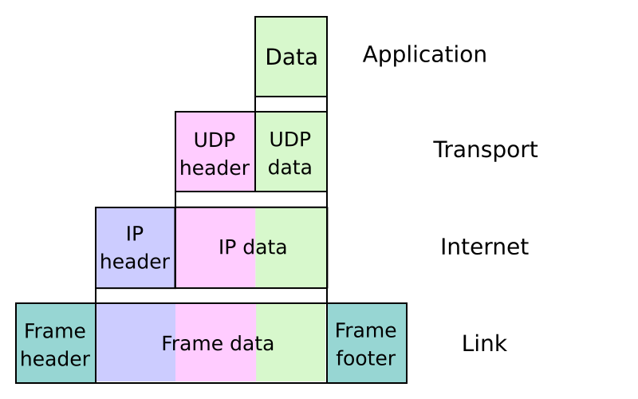

#software/networking
On any given computer, there are several pieces of software that comprise the 'network stack'. This is done to allow for easy replacement and debugging of any individual piece. To model this 'stack', there are two main models - OSI and TCP/IP. While some people _do_ use OSI, it is becoming increasingly common to use TCP/IP rather than OSI.

<table style="width:100%">
<tr><th>OSI Number</th><th>OSI Name</th><th>TCP/IP</th></tr>
<tr><td>7</td><td>Application</td><td rowspan="3" style="vertical-align:middle">Application</td></tr>
<tr><td>6</td><td>Presentation</td></tr>
<tr><td>5</td><td>Session</td></tr>
<tr><td>4</td><td>Transport</td><td>Transport/Host-to-host</td></tr>
<tr><td>3</td><td>Network</td><td>Internet/Network</td></tr>
<tr><td>2</td><td>Data Link</td><td rowspan="2" style="vertical-align:middle">Link/Network Access</td></tr>
<tr><td>1</td><td>Physical</td></tr>
</table>

The abstraction provided by this allows not just for easy maintenance of this structure in the real world, but is also useful when trying to model whole networks, irrespective of the exact hardware running the network - each device will act on one (or several) of these layers. Thus, all we need to worry about are the interactions between these levels.
One other advantage of this model is that it allows for end-to-end transparency - for two devices, their application layer will only 'see' the other computer's application layer, transport will only 'see' transport, network only  'sees' network and so on. To lower level layers, the upper layers are simply just binary blobs they don't care about, and to the higher level layers, the lower levels simply don't exist beyond invoking them or receiving a binary blob to decode.
### Link Layer
This layer specifically deals with the physical transmission of data to/from each host.
##### Software Standards
- 48-Bit MAC addresses
##### Hardware Standards
Many of the standards pertaining to the physical standards of the internet are generally parts of either the IEEE 802.XX or ITU standards. 
- Ethernet (IEEE 802.3)
- Wireless LAN/WIFI (IEEE 802.11 a/b/g/n/ac/ax)
- Wireless Personal Area Networks (IEEE 802.15)
	- Bluetooth (IEEE 802.15.1)
	- Low-Rate WPAN (IEEE 802.15.4)
- GPON (ITU G.984)
- ADSL (ITU G.992, ANSI T1.413)
- VDSL (ITU G.993)
- G.fast (ITU-T G.9700, G.9701)
### Internet Layer
The internet layer has three main functions: handling the routing of the 'next hop', providing globally unique* addressing and passing packets on to the correct next layer. This layer also allows for connection to many different types of network without any of the above layers having to worry about it. 
The information transfer of this layer is generally provided on a 'best effort' basis, where if a packet is dropped or corrupted, there is no retry automatically performed.
##### Protocols
- Internet Protocol
	- IPv6
	- IPv4
- Diagnostics, Control
	- ICMPv6
	- ICMP
- 
- IPSEC

> [!info] Globally unique addressing
> While it definitely used to be that way, there are now not enough IPv4 addresses to allow for this, thus the addressing at this layer is not _always_ unique. In fact, nowadays, it is usually not.
### Transport Layer
This is the layer that provides 'host-to-host' communication. While the lower layers only ever communicate with physically connected devices, this layer connects with the software of the other host.
##### TCP vs UDP
TCP (Transfer Control Protocol) and UDP (User Datagram Protocol) are both protocols that operate on the transport layer, but they have significant differences that are important when choosing which one to use as part of any given program.

|                             | TCP                                | UDP                                                    |
| --------------------------- | ---------------------------------- | ------------------------------------------------------ |
| Connection                  | Connection-Oriented                | Connectionless/"Fire and Forget"                       |
| Reliability                 | Handles acknowledgement and retrys | Applications need to handle acknowledgement and retrys |
| Data Order                  | Correct ordering is guaranteed     | Data comes in in any order                             |
| Header                      | At least 20 bytes                  | 8 Bytes                                                |
| Good For                    | High Reliability                   | High Speed/Low Latentcy                                |
| Application Layer Protocols | HTTP(S), FTP, SMTP, Telnet, SSH    | DHCP, TFTP, SNMP, RIP, RTP, COAP                       |
### Application Layer
This is the layer which most programs interact with. Most libraries interact with this layer.
### DNS
The domain name system, also known as DNS is one of the most fragile steps in making a web request. It is a distributed tree-like network that translates URLs into IP addresses.
### An Example Packet
If, for example, a person wanted to request a webpage, the data required to do so would need to go through many layers, including the ones featured above. 