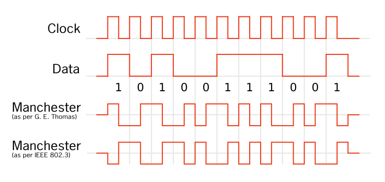

#software/networking/link-layer
The link layer is the lowest layer of the [TCP/IP stack](Layered%20Network%20Model.md) that deals with the physical transmission of data. In this layer, unlike in the higher layers, data is considered to be given in units of 'frames', in the same way that at the [internet layer](Layered%20Network%20Model.md#Internet%20Layer) uses packets. 

Because there are also so many different ways by which data can be physically moved, there are also a lot of differing protocols, each dealing with one specific solution. However, because these protocols all need to eventually deal with higher layers on the TCP/IP stack, they all share at least one feature: the MAC address. This is a six byte address, sometimes also called the 'physical address' that, no matter _how_ data enters and exits a device, still uniquely identifies the device on the network.
### Common Standards
There are all sorts of esoteric and unique methods for sending data in the link layer. Below is a non-exhaustive list of some of the more notable ones.
- Ethernet (IEEE 802.3)
- Wifi (IEEE 802.11a/b/g/n/ac/ax)
- Bluetooth (IEEE 802.15.1)
- Low Rate WPAN (IEEE 802.15.4)
- ADSL (ITU G.992)
- VDSL (ITU G.993)
- G.fast (ITU-T G.9700 & G.9701)
- 3G
- 4G (LTE)
- 5G-NR (5G)
### Transmitting Bits 
##### Encoding Bits
Pretty much universally, protocols at the link layer don't just send the data in binary, they usually encode it to make it more resilient to corruption, usually by using more than  just the state of the voltage to encode information.
There are some common encodings used such as [Manchester encoding](https://en.wikipedia.org/wiki/Manchester_code), [8b/10b](https://en.wikipedia.org/wiki/8b/10b_encoding) and more. The simplest of these, Manchester encoding, for example, works by encoding bits by rising and falling changes in the signal rather than the signal itself.

##### Packets/Frames
In the link layer, unlike in the higher layers, the payload is not just given a header, it is in fact prefixed with a header and postfixed with footer, though this may be as small as a single byte. This is generally a longer pattern which is used to specify the end of the PDU. This is needed because unlike the layers above, protocols at this layer tend not to specify a length field explicitly and require a footer.

> [!note]- Like strings
> In some ways this can be compared to the difference between C-strings and C++-style strings. `char[]` requires a delimiter, of `\0`, but `std::string` contains a length field, so no delimiter is needed.
> 
##### Example Frames
Ethernet:

802.15.4 WPAN

> [!info] Flow Control
> Some protocols may or may not provide flow control as part of their protocol. The way this is implemented varies between protocols.

### Receiving Bits
There are three main models for sending and receiving data:
- Unacknowledged, Connectionless
	Frames are sent and may be received. This is generally used with more reliable connections, as is typically found with ethernet. 
- Acknowledged, Connectionless
	Frames are sent and if received an acknowledgement message is sent back. This is generally used with less reliable connections that are still reasonably fast, such as wifi.
- Acknowledged, Connection-Oriented
	Frames are sent back and forth with an actual connection. This is used in slow, unreliable links, like with satellite communication.
##### ACK Strategies
When using a transmission strategy that requires data to be acknowledged, there are two main ways by which that acknowledgement can take place.
1. Stop and Wait
2. Pipelined ACKs
In the former strategy, a packet is sent and the sender waits until it receives an ACK back before sending any more data. This can be improved upon by using pipelining. Several packets of data are sent, with the sender expecting to start receiving a series of ACKs as they continue sending. If an ACK does not come through for a packet, all the packets including the one that was not acknowledged and onwards are retransmitted. Alternatively, if ACKs are received for packets after the un-ACK'ed one, then only that one may be re-sent.
##### Checksums
Many protocols for wireless communication not only include provisioning for ACKs, but also include a checksum of some kind. Whether that is as simple as a parity bit, or as complex as a CRC-type checksum. While lots of protocols in higher layers may also include a checksum, sometimes it can be useful to have a checksum at this layer, even if just to know to drop a packet and wait for its retransmission.
### Contention
When two devices may communicate using the same 'bus', rather than using a fully duplex link to all other devices on the network, you can run into 'contention', where two devices send data at the same time, garbling the message. In fact, this used to be quite common, as early ethernet often ran into this issue. The result of this was that it was quite important that methods were created to reduce the amount of interference, increasing bandwidth.
##### CSMA/CD
CSMA/CD is a simple method of performing retransmission if it is detected that two devices have overwritten each other: simply listen to the same line that is being sent on as you send data and if you don't receive what you're sending, your signal is being corrupted. Then, you should wait a random amount of time before trying again. After some number of tries, give up.
##### CSMA/CA
CSMA/CA works a lot like CSMA/CD. However, when going to start a transmission, instead of just starting your transmission and hoping that nobody is also sending and dealing with it if they are, listen to the line first and wait until it is free, plus some random time more to prevent multiple devices using this strategy from guaranteeing contention.