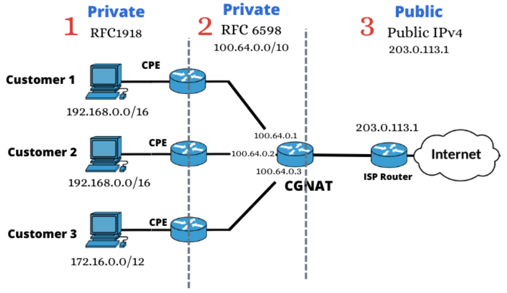

#software/networking/transport-layer
### NAT
When setting up an IPv4 network, it is often desirable to use a _private address space_. This means that within your network you can use whatever IP addresses you want, without worrying about whether that clashes with IPs outside your network. However, if you then want to connect your network to the wider internet, you are then faced with a problem - all your devices are using IP addresses on the wider internet that you don't own. The solution: Network Address Translation - you get just one IP address for your network, then share the use of it between all devices on your network.


This works by having NAT enabled routers re-write parts of your packet (also called packet mangling) and keep track of open connections. More specifically,
- you send a packet via the router
- the router knows that the source IP and source port that you put in the packet is your private address and port, so replaces it with the public one address and one of its ports
- the router re-calculates the header checksum to conform with this new data.
- the router sends the packet onwards, keeping track of the connection that was opened, so that when a packet comes back, it remembers that it is a response to your specific private address

> [!note] Vendor Specifics
> Each vendor may implement this basic concept in all sorts of different ways, and rarely publicly documents the way they do it, so this is about the most detailed we can get.

> [!tip] NAPT
> In reality, the process described above is actually Network Address and Port Translation, given the acronym NAPT, but pretty much everyone just calls it NAT

##### CGNAT
With the exhaustion of IPv4 addresses continuing, the use of NAT has become widespread to help combat the lack of addresses available. As the shortage has only become more severe, a new level of NAT has been widely introduced: Carrier Grade Network Address Translation.



Essentially, this allows ISPs to have only a single/few address(es) and NAT out a whole address space, which will then be locally NAT'ed out again. This means that we are now using NAT on address spaces made by using NAT. In some cases, people may be using devices that are three levels of NAT deep! This is obviously highly complicated and expensive to run, but people will do whatever it takes to keep IPv4 running.
### Routing
When trying to send a packet between two hosts on the internet, there can be many routers between them. Since each device can only see the devices to which it is directly connected, it is important that each device can make the most optimal decision as to where to send packets it receives. This decision-making is called routing.

At the host, and each router thereon, the first decision that needs to be made is whether the packet is destined for a host that is link-local and can be reached directly, or needs to be sent on to another router. 

> [!info] Gateways
> A gateway is simply a router that connects a subnet to its higher parent [subnet](Internet%20Protocol.md#Subnets) (e.g. a [`/24`](Internet%20Protocol.md#Netmasks) to a [`/23`](Internet%20Protocol.md#Netmasks)). However, not all packets need to go through a router - specifically, any link-local packets are, by definition, not routed and are destined for other devices on the same subnet.

##### Routing Tables
To facilitate that, devices on a network maintain a 'routing table' that tell it where it should send packets destined for specific IP ranges. Below are example routing tables on windows 11 (obtained via abridged versions of `route print -4` and `route print -6`)

```
IPv4 Route Table
===========================================================================
Active Routes:
Network Destination        Netmask          Gateway       Interface  Metric
          0.0.0.0          0.0.0.0      192.168.0.1    192.168.0.238     30
        127.0.0.0        255.0.0.0         On-link         127.0.0.1    331
        127.0.0.1  255.255.255.255         On-link         127.0.0.1    331
  127.255.255.255  255.255.255.255         On-link         127.0.0.1    331
      169.254.0.0      255.255.0.0         On-link    169.254.17.126    281
   169.254.17.126  255.255.255.255         On-link    169.254.17.126    281
  169.254.255.255  255.255.255.255         On-link    169.254.17.126    281
       172.26.0.0    255.255.240.0         On-link        172.26.0.1    271
       172.26.0.1  255.255.255.255         On-link        172.26.0.1    271
    172.26.15.255  255.255.255.255         On-link        172.26.0.1    271
      192.168.0.0    255.255.255.0         On-link     192.168.0.238    286
    192.168.0.238  255.255.255.255         On-link     192.168.0.238    286
    192.168.0.255  255.255.255.255         On-link     192.168.0.238    286
        224.0.0.0        240.0.0.0         On-link         127.0.0.1    331
        224.0.0.0        240.0.0.0         On-link     192.168.0.238    286
        224.0.0.0        240.0.0.0         On-link        172.26.0.1    271
        224.0.0.0        240.0.0.0         On-link    169.254.17.126    281
  255.255.255.255  255.255.255.255         On-link         127.0.0.1    331
  255.255.255.255  255.255.255.255         On-link     192.168.0.238    286
  255.255.255.255  255.255.255.255         On-link        172.26.0.1    271
  255.255.255.255  255.255.255.255         On-link    169.254.17.126    281
===========================================================================
IPv6 Route Table
===========================================================================
Active Routes:
 If Metric Network Destination           Gateway
  1    331 ::1/128                       On-link
 13    286 fe80::/64                     On-link
 67    271 fe80::/64                     On-link
 21    281 fe80::/64                     On-link
 13    286 fe80::2e8d:a6f2:60b:96cb/128  On-link
 67    271 fe80::3a94:d013:e137:2437/128 On-Link
 21    281 fe80::6206:97b6:1f5f:5eda/128 On-link
  1    331 ff00::/8                      On-link
 13    286 ff00::/8                      On-link
 67    271 ff00::/8                      On-link
 21    281 ff00::/8                      On-link
===========================================================================
```
Note that all `On-Link` gateways are simply link-local or are the machine itself. There are several interface active on this machine, which are represented differently between [IPv4](Internet%20Protocol.md) and [IPv6](Internet%20Protocol.md). On [IPv6](Internet%20Protocol.md) they are numbered (on the `If` column) and on [IPv4](Internet%20Protocol.md), they have differing [addresses](Internet%20Protocol.md#Address%20Conventions) which must be cross-referenced with another table. 

> [!important] Routing Order
> As can be seen in the above tables, routing tables often contain duplicate routes, or can contain address ranges that contain each other. This means that one must be chosen over the other. To do this, a specific order is always used.
>
> 1. First, find the most **specific** IP range. 
> 	To get to`169.254.17.126`, it is preferred to use the entry for `169.254.17.126/32` rather than `169.254.0.0/16` rather than `0.0.0.0/0` (the default gateway). Similarly, it is preferred to use `172.26.0.0/20` to get to `172.26.0.12` than `0.0.0.0/0`.
> 2. Use the **lowest** metric
> 	The 'metric' is considered the 'distance' to the specific device with that address. Thus, lowest wins. It is preferred to get to `224.0.0.0` via the interface on `172.26.0.1` rather than any others because it has the lowest metric. 
> 	
> 
>  **Example**
> 	- To get to `192.168.15.10`, the route highlighted in <span style="color:rgb(162, 185, 226)">light blue</span> would be used. While the route under it and the route above it could also get to `192.168.15.10`, it is the most specific, as it has the smallest netmask.
> 	- To get to `10.10.10.50`, the route highlighted in <span style="color:rgb(197, 90, 17)">orange</span> would be taken. While there are two other gateways above it that would also work, the highlighted one has the lowest metric.
##### Routing to the Internet
When the destination address is not link-local, the packet needs to be sent to a connected subnet that may know the way. To do this, the packet must be sent to the _default gateway_. This is the gateway that all packets are sent that cannot be delivered directly. This is generally seen as the gateway on the routing table with a destination of `0.0.0.0/0` or its equivalent in [IPv6](Internet%20Protocol.md), [`::/0`](Internet%20Protocol.md#IPv6%20Address%20Simplification). The default router usually has a much larger routing table, often with thousands of entries that quickly change to stay up to date with the fastest routes.
##### Autonomous Systems
Because of the complication inherent here, manual configuration is simply no longer feasible and so we get routers to configure these things themselves, autonomously. When large groups of routers all have the same policy, usually because they are all owned by the same organisation, they are called _autonomous systems_. The internet is by-and-large made entirely of interconnected autonomous systems, each given a number by the same bodies that hand out IP addresses.

There are three types of autonomous system (AS):
- Multihomed
	An AS that is connected to more than two other autonomous systems. E.g.: France Telecom in the diagram to the right
- Transit
	An AS that is connected to two other autonomous systems. E.g.: Cogent in the diagram to the right
- Single-Homed/stub
	An As that connects to only one other autonomous systems. If that autonomous system has the same routing policy, it may seem that this is a wasted system, but it may be that this hides some sort of private link, as might be found between financial institutions engaging in high-frequency trading.
##### Routing Protocols
When routing between different types of networks, there are different types of routing protocol that are used:
- Interior Gateway Protocols
	Used when routing within an autonomous system
- Exterior Gateway Protocols
	Used when routing between autonomous systems (over the general internet)

Of the interior gateway protocols, the most common types are 'distance vector' based and 'link state' based. The former works by each router only talking to neighbouring routers, each exchanging what information they have about the best routes to other parts of the network. The latter is a bit more complex, where each router broadcasts to the whole network what it knows, so each network device is able to create a full map of the network topology and evaluate all routes.
###### Routing Information Protocol
The Routing Information Protocol (RIP) is one of the most commonly used 'distance vector' based protocols. It is a very simple protocol that only cares about hop-count. That is, instead of using any measured metric, like RTT between neighbours, it just cares about how many hops it takes to get to the next router. It works by each device sending its whole routing table to its neighbours periodically, with receiving routers potentially updating their own routing tables if they find a better route.


While RIP works well with simple network topologies, it does have some significant limitations:
- Maximum count of 15
	It can only know about prefixes a maximum of 15 hops away, if a prefix is 16 hops away, it is considered unreachable.
- Susceptible to loops
	If especially large loops are found in the network topology, it is possible for packets to get stuck in loops, as each router only knows the locally best option.
- The metrics are just hop-counts
	The metrics are not determined on measured speed, just number of hops, which can result in poor routing decisions.
- RIP uses MD5 hashes for authentication
	MD5 has been broken for many years, so it cannot be considered even remotely cryptographically secure.
###### Link-State Routing
Link-State routing is generally done using one of two main protocols: IS-IS or OSPF. It works by first discovering neighbours and assigning them some cost metric, then broadcasting this information to all routers, not just connected ones. Then, routers on the network can use this information to build an edge-weighted graph, representing the network. By this method, it is possible to make the best possible routing decisions by utilising [Djikstra's Algorithm](../../AICE1005%20Algorithms%20and%20Analysis/Algorithms/Graph%20Traversal.md#Djikstra's%20Algorithm). 
###### Link-State vs Distance Vector
In practice, it is generally preferred to use link-state routing algorithms, as they tend to converge on the best routing faster and are better at avoiding loops. However, in exceedingly large networks, they are also more likely to generate overwhelming amounts of traffic.
###### Border Gateway Protocol
Border Gateway Protocol (BGP) is an _exterior gateway protocol_ and is the generally accepted protocol for communication between autonomous systems. While it is generally similar to distance vector based routing protocols, it does provide more information about routes through and between autonomous systems that allow it to be more efficient than that.

While BGP works well, it does have some major downsides, first and foremost of these is that it relies on _trust_. A malicious peer can cause your AS to route traffic to it, rather than the actual best route. It is also quite slow to update, so having systems that activate and deactivate quickly using BGP can have adverse effects on the whole network of autonomous systems. Another one of its major issues is that most routers have quite limited BGP routing tables, so are unable to store all that many nodes. With the exhaustion of IPv4 and the introduction of IPv6, which takes four times the data to store, some older BGP-supporting devices are becoming obsolete.
### Routing in Practice
##### Sending a packet to a link-local address
If we have a packet that we want to send to an address on the same subnet as us, we perform ARP or Neighbour Solicitation/Discovery to get the MAC address of the device. Then, we simply send the packet out, via the switch (layer 2) , which will forward it on to the destination device based on its MAC address. 
##### Sending a packet to a remote address
If we have a packet that we want to send to an address that is, for example, in a datacentre somewhere else, we first determine that the IP is not link local by noticing that it is not in our subnet. Then we perform ARP or Neighbour Solicitation/Discovery to get the MAC address of the default gateway, the L3 router on the edge of the subnet. Then, we send our packet to the router (L3) via the switch (L2) and then it uses its routing table to determine whether it is connected to the subnet that contains the destination address. If not, then it will send it to _its default gateway_, which will then again perform the check to see if it is connected to a subnet containing the destination address. This continues on until some router is connected to the subnet containing the address, in which case the packet will then be sent from router to router, slowly narrowing towards smaller and smaller containing subnets until it reaches the destination's link-local router. This will then perform ARP/NDP to get the destination MAC address and send the packet to its final destination.
##### Device Topology for an Example Network

```
  Devices
   | | |
   v v v
Switch (L2)
     |
     v
Edge Router (L3)
     |
     v
Firewall (L7), NAT (L4), other stuff (various layers)
     |
     |                  your network
____ | _________________________________________
     |                 ISP's network
     v
Edge Router (L3) 
     |
     v
ISP's Autonomous System's Routers
```