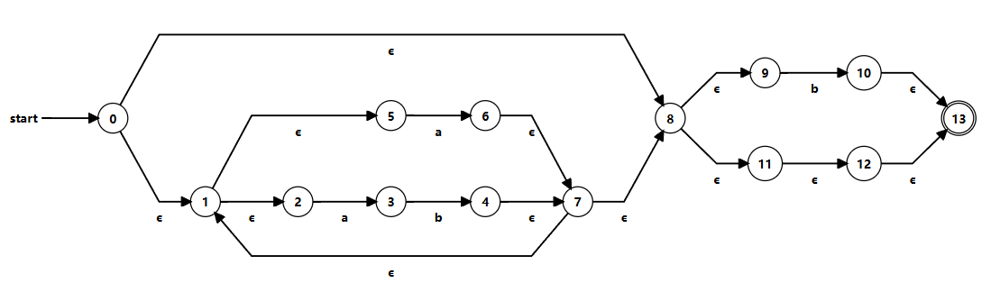

### Regular Languages
A _regular language_ is, informally, a language that can be defined by a regular expression. However, due to the many features of modern regex engines, many are able to support non-regular expressions. To be more precise, a regular language over the alphabet $\Sigma$ is one defined by the following rules:
- The empty language $\emptyset$ is a language
- For any $a \in \Sigma$, the singleton language $\{a\}$ is a regular language
- If $A$ is a regular language, $A^*$ is a regular language, where $^*$ is the _Kleene star_, or informally an operator meaning 'at least 0 of'. For example, $a$, $aaa$, $aaaaa$ and $a$ all are expressions in the regular language $a^*$.
- If $A$ and $B$ are a regular languages, then $A\cup B$ (union) and $A \cdot B$ (concatenation) are regular languages
- No other languages are regular
Moving this back to standard regular expressions, this means that a language can be defined by the following regex constructs: `*`, `|`, `?`, `(?:)` (the non-captured group) and basic (potentially escaped) characters
### Defining NFAs
A Non-deterministic Finite Automaton (NFA) is a graph-based representation of a state-machine. Simply put, it is made of various 'states' (vertices) which are connected by 'transitions' (directed edges). Such a graph may contain transitions that connect a state to itself. An NFA can then be used for computation by, for some input, at each node, consuming some portion of the input, then deciding what state to transition to based on that input. All 'characters' in the input must always be consumed.

There are two main features that set NFAs apart from other finite automata:
- 'epsilon' transitions - a transition that does not consume any input
- evaluating an NFA may require 'lookahead', or otherwise knowledge of the future, when multiple transitions consuming the same input are available
While it is not explicitly a rule, generally NFAs only have a single 'accepting' or finishing state. They may have several 'trap' states for explicitly non-accepting input.

The above is an NFA that represents the regex `/(?:ab|a)*b?/`
### Defining DFAs
A Deterministic Finite Automaton is a sub-type of NFA that is always perfectly deterministic for the same input and never requires knowledge of the future or backtracking to evaluate. To do this, they come with some special rules:
- No epsilon transitions
- A state may only have a single transition for each 'input' consumed
To make this possible, it is common to have many accepting states.

Despite the fact that DFAs are a subset of NFAs, they are capable of representing the exact same set of regular languages (all of them), and any NFA can be converted into a valid DFA.

### Computing an NFA from a regular expression
To compute a NFA from a regex, break the regex down into its most nested parts, building up the NFA out of standard sub-NFAs.

| Pattern  | NFA                                           |
| -------- | --------------------------------------------- |
| a        |  |
| **a\|b** |  |
| **a\***  |  |
| **a?**   |  |
Where necessary replace `a` or `b` transitions shown above with nested sub-patterns.
### Computing a DFA from an NFA
To compute a DFA from an NFA, the first step is determining the NFA's transition table. This will have a row for each state in the NFA and a column for each token in the alphabet. Cells will then contain the set of states that can be reached from the row-state when the column-input is consumed.

Then, we determine the set of states in the NFA that are in the $\varepsilon$-closure of the start. This is the set of all states that can be reached from the start by only epsilon transitions.

Then to build the DFA transition table, we create the same columns as the NFA transition table (as the alphabet has not changed), but we define only one row to start with - it has the set of states in the NFA reachable from the start by only epsilon-transitions - the $\varepsilon$-closure of the start. Then, for each input token, we then fill out the sets of states that can be reached by the row/state set under that input, including by epsilon transitions afterwards. 

Once we have created the first row, we then add rows for each state set found in the cells in that row that don't already have a row and fill them out as before.

Finally, when we are no longer able to create new rows, we determine the accepting states. These are all the states defined by the sets containing the accepting state in the NFA. Finally, from this completed DFA transition table, we can build the DFA.

> [!proof]- Building a DFA from an NFA
> Using the NFA shown above (reproduced here): 
> We get the transition table:
>
>The starting state is 0 and its epsilon closure is {1, 2, 5, 8, 9, 11, 12, 13}, so we then start our DFA transition table by
>
>Then, filling out the set of states reachable from this DFA state by the input and further epsilon closures
>
>Then adding these as new rows gives us this:
>
>This gives us one new row to add, finishing the table:
>This table only contains states also containing the accepting state 13, so all states are accepting. Then, we build the DFA (shown below)
>
### Computing a DFA from a regular expression
The reliable way to do this is to convert the regular expression to an NFA and then the NFA to a DFA, but it may be faster to go straight to the DFA. This is mostly a game of educated guesswork, but one common pattern is that of 'regimes', where a node transitions into itself via some token, and transitions out of itself by some other, which is useful when making constructs involving `*`. Otherwise, just keep track of where it would be valid to accept, and remember that DFAs do not stop executing until they have consumed the entire input, so if there is an opportunity to accept early, it will never be taken. 

> [!info] Regular Expression Compilers
> [Compile a regular expression to a DFA](https://cyberzhg.github.io/toolbox/nfa2dfa)
> [Compile a regular expression to an NFA](https://cyberzhg.github.io/toolbox/regex2nfa)