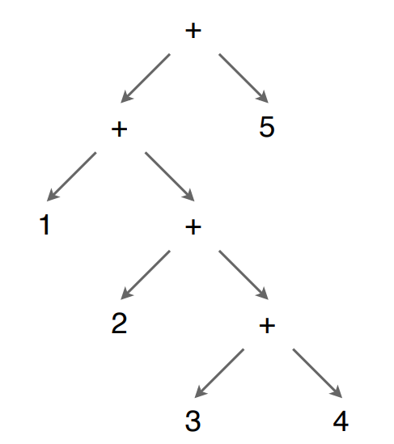

#software/compilers/parsing
Parsing is the act of turning a stream of tokens (usually from a [lexer](./Lexing.md)) into an abstract syntax tree. Like with lexers, _parser generators_ such as `yacc` and `ocamlyacc` exist to do this, but hand-written parsers are also not unheard of. One notable example of a hand-written parser and lexer are those used by the GNU C compiler. 
### Context-Free Grammars
A Context-Free Grammar (CFG) is a language grammar that is capable of specifying a Context-Free Language. This is a greater class of languages than a [regular language](./DFAs%20and%20NFAs#Regular%20Languages). It sits in the [Chomsky Hierarchy](https://en.wikipedia.org/wiki/Chomsky_hierarchy) of languages above regular languages and context-sensitive languages.

Context-Free Grammars are generally specified by a list of rules in reverse, IE. how to go from a stream of tokens back to the original source code. That is, we specify how we can replace _non-terminal_ tokens with strings of _terminal_ and _non-terminal_ tokens that more precisely specify the original structure of the context-free language.

To do this, specific _syntax_ is used in the _meta-language_ of describing the grammars that describe languages. It is a reasonably simple syntax, best shown with examples.
##### Language of Balanced Brackets

$$S\longmapsto S\ |\ (S)S\ |\ \epsilon $$
Above is the CFG for the language of balanced brackets e.g. `((())(()(())))`. It contains three productions ($S\longmapsto S$, $S\longmapsto (S)(s)$ and $S\longmapsto\epsilon$), two terminal tokens '(' and ')', and a single non-terminal symbol $S$, which is also the starting symbol.

The non-terminal $S$ may be 'expanded' into either itself, or the string of tokens containing the terminal '(', the non-terminal $S$, the terminal ')' and another copy of the non-terminal $S$. It is common to say that some string in the language may be 'derived' by starting at a single base token ($S$, in the case above) and re-writing it over and over again until the string has been created.

Note the use of $\epsilon$, which is used to denote the empty string. Thus, we can have that the token $S$ may derive to nothing, which is useful, as, for example $S$ derives to $\epsilon$ at the most nested layers of the brackets language example shown above.
##### Language of Addition#
$$S\longmapsto E + S\ |\ E; E\longmapsto\text{number}\ |\ (S)$$
This is the CFG of the language of brackets with addition and numbers. eg. `(1+2+(3+4))+5` It contains four terminal tokens and two non-terminal tokens. The starting non-terminal token is $S$.

In questions, it is not uncommon to see a question asking to show the derivation of a sentence in a context-free language from its given grammar. Using the above as an example, we get that:
```
S ⟼ E* + S
  ⟼ (S*) + S 
  ⟼ (E* + S) + S 
  ⟼ (1 + S*) + S 
  ⟼ (1 + E* + S) + S 
  ⟼ (1 + 2 + S*) + S 
  ⟼ (1 + 2 + E*) + S 
  ⟼ (1 + 2 + (S*)) + S 
  ⟼ (1 + 2 + (E* + S)) + S 
  ⟼ (1 + 2 + (3 + S*)) + S 
  ⟼ (1 + 2 + (3 + E*)) + S 
  ⟼ (1 + 2 + (3 + 4)) + S* 
  ⟼ (1 + 2 + (3 + 4)) + E* 
  ⟼ (1 + 2 + (3 + 4)) + 5
```
> Note that the `*` is present at the token currently being expanded between this step and the following one.

This derivation is called a _left-most_ derivation, in that the left-most non-terminal token is always expanded first. An equivalent derivation could be performed _right-most_, where the right-most non-terminal token is always expanded first. Either one will always give the same eventual result, assuming the grammar is well-formed.
##### Derivations to ASTs
To turn a derivation into an abstract syntax tree, it is helpful to first view the derivation as a tree in and of itself. Consider each expansion of a token as adding replacing a leaf-node with a n-way branch, where n is the length of the string produced by the production used to expand the non-terminal token. Then, each token produced is added as a child to the non-terminal. As an example, using the derivation above for the language of addition, the parse tree to the right can be created. 

Then, once the parse tree has been created, that tree can be pruned using reasonably simple rules to produce the _Abstract Syntax Tree_ shown to the left.
### LL(k) Grammars
An LL(k) grammar is a context-free grammar that is capable of specifying subset of all context-free languages. Specifically, an LL(k) grammar is unable to express grammars with left-recursion or requiring a 'lookahead' of more than $k$ symbols of the string to disambiguate between possible 'productions' of tokens for a given non-terminal token. 
### Deriving the parse table for an LL(k) grammar
An LL(k) grammar parse table is a table of direct productions, with a row for each non-terminal in the grammar and column for each k-tuple of terminals. For example, an LL(1) table has columns for each non-terminal (1-tuple), LL(2) has columns for each pair of terminals (separate columns for (`tok_a`, `tok_b`) and (`tok_b`, `tok_b`)), LL(3) has columns for each triplet of terminals and so on.

To fill out the table, the following rules are used:
- For each production $A := \alpha$, where $A$ is a nonterminal and $\alpha$ is a string of terminals and non-terminals
	- If the column $(t_1, t_2, \dots,t_k) \in \text{FIRST}_k(\alpha)$, fill the cell with row $A$ and column $(t_1, t_2, \dots, t_k)$ with $A := \alpha$
	- If the column $(t_1, t_2, \dots, t_k) \in \text{FOLLOW}_k(A)$ and $\alpha$ can, by some series of productions, be reduced to $\varepsilon$, fill the cell with row $A$ and column $(t_1, t_2, \dots, t_k)$ with $A := \varepsilon$ 
- $\text{FIRST}_k(\alpha)$ gives the set of k-tuples of the first $k$ tokens of all the token strings derivable from the token string $\alpha$. In the degenerate case where the string $\alpha$ is a single non-terminal for which a production exists, $\text{FIRST}_k(\alpha) = \bigcup_{\beta\in B}\text{FIRST}_k(\beta)$, where $B$ is the set of all token strings produced by the non-terminal $\alpha$.  
- $\text{FOLLOW}_k(A)$ gives the set of k-tuples of terminal tokens that may follow the non-terminal token $A$ in any token string derivable from token strings containing $A$
	- For example, in the LL(k) grammar snippet below, $\text{FOLLOW}_k(B)=\text{FIRST}_k(C)$ as the $k$-tuples of tokens that can follow $B$ are the first $k$ tokens of strings derivable from $C$. If $C$ can produce $\varepsilon$, then $\text{FOLLOW}_k(B)=\text{FIRST}_k(C)\cup\text{FOLLOW}_k(A)$, as the terminal tokens following $B$ if $C$ is epsilon are the tokens that can follow $A$. 
```
	A := BC
	B := < some non-terminal token only referenced by A >
	C := < some non-terminal token >
```
- Token string 'derivation', is simply deriving a (possibly) different string of tokens from another by applying a production to any of the tokens in the string any number of times.