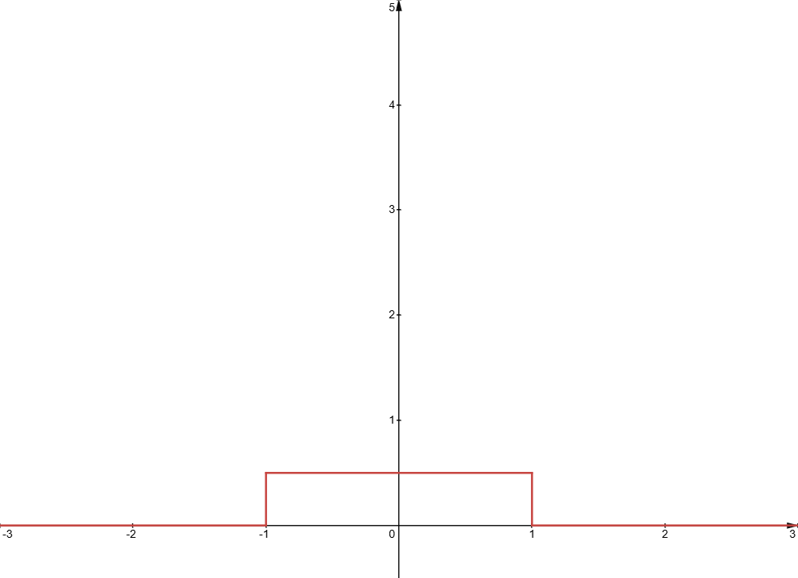

#maths/applied-maths/signals-and-control/signals
A continuous signal is represented by a function of the form $x = f(t)$, where $t$ is the current time. Signals may be scalar, complex or otherwise vector-valued. Such a signal may be time-shifted by $h$, which produces another signal that is by convention notated as:
$$\psi(t) = x(t - h)$$
Similarly, a signal compressed in time would be notated as: $$\psi(t) = x(2t)$$ In general, derived signals are often notated as $\psi$.
### Continuous and Discrete Signals
A signal may be either continuous or discrete. Most signals based on the real world are continuous - e.g. the current flowing through a wire. However, when it comes to processing a continuous signal, it is often required to sample it to turn it into a discrete sample. This will introduce some error, known as quantisation error.
### Even and Odd Signals
A signal is even or odd by the same definition that a function may be even or odd.
### Energy and Power Signals
At some specific time $t$, a signal can have an instantaneous power of $|x(t)|^2$. We can continue this definition into finding the total energy of some signal, which is given as $$E =\int^\infty_{-\infty}|x(t)|^2dt$$The total average power of a signal is then given by $$P = \lim_{T\to\infty}\frac{1}{T}\int^T_{-T}|x(t)|^2dt$$If a signal has finite energy and a finite total power then it is considered an _energy signal_ and if it has infinite energy, but still finite total power, then it is a _power signal_. If a signal has both infinite power and infinite energy then it's not physically realisable.

The way to intuit this is by looking at a graph of instantaneous power output against time.
If the graph produced tends to zero as time tends to infinity and does not tend to +/- infinity as time tends to zero, then the area between the curve and the x-axis is bounded. Thus - we can way that if a signal 'is on' for a finite amount of time then it must be an energy signal. 

Otherwise, if the area under the curve is infinite, but the rate at which it grows (the y-value) is finite, then the curve shows power.

### Deterministic and Stochastic Signals
The value of a deterministic signal can be determined by some mathematical expression, whereas a stochastic signal is one that is determined purely by statistical methods. When noise (which is a stochastic signal) can be considered to be small or negligible, a deterministic signal with noise can be approximated as a purely deterministic signal.
This module will only cover deterministic signals.
### Dirac Impulse Function
There are a series of functions defined by the following property:
$$\int^{\epsilon/2}_{-\epsilon/2}\delta(t)dt = 1$$
To fulfil this property, we choose to use the impulse function shown below:
$$\delta_\epsilon(t)=\begin{cases}-\epsilon<t<\epsilon : \frac{1}{\epsilon}\\ 0\end{cases}$$
If we then take this to the limit as $\epsilon\to\infty$, we get the _(Unit) Dirac Impulse Function_ (also known as the _Dirac Delta Function_), which may also be defined as:
$$\delta(t)=0, t\ne 0\hspace{24pt}\int^\infty_{-\infty}\delta(t)dt=1$$
Because the unit Dirac impulse function is only non-zero at $t=0$, we can hence say that for any function $\psi(t)$,
$$\psi(t)\delta(t)=\psi(0)\delta(t)$$
$$\int^\infty_{-\infty}\psi(t)\delta(t)dt=\psi(0)$$
##### The Dirac Impulse Function and Convolution
When analysing systems that are [linear](./Systems.md#Linear%20vs%20Non-Linear%20Systems) and [time invariant](./Systems.md#Time%20Invariant%20Systems) ([LTI Systems](./Systems.md#LTI%20Systems)), it is useful to make use of convolution to define them. This also leads onto the final important property of the Dirac impulse function - under convolution, it acts as an identity.
$$x(t)*\delta(t)=x(t)$$
##### Derivatives of the Dirac Impulse Function
The Dirac impulse function, while it may be called a function, is actually a distribution - something slightly different to a function. This means that though as a function the Dirac impulse function is absolutely not differentiable, we can still make sense of its derivatives.

Rigorously, the derivatives of distributions are defined as moving the derivative into the signal it is multiplied with, potentially with a sign change to go along with it. This can be non-rigorously justified by looking at it as a function that we can use _integration by parts_ on.
$$\int^\infty_{-\infty} x(t)\delta'(t)dt=\left[x(t)\delta(t)\right]^\infty_{-\infty}-\int^\infty_{-\infty}\delta(t)x'(t)dt$$
Because we are evaluating the $uv$ term ($\left[x(t)\delta(t)\right]^\infty_{-\infty}$) outside of the section it is defined to have a non-zero value, this part reduces to zero, allowing us to see that
$$\int^\infty_{-\infty} x(t)\delta'(t)dt=-\int^\infty_{-\infty}\delta(t)x'(t)dt$$
For higher-order derivatives, it is plain to see that another invocation of _integration by parts_ would be needed, and would further flip the sign back to positive. 
